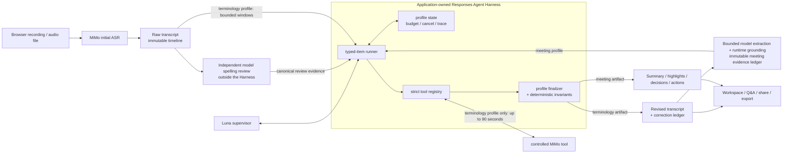
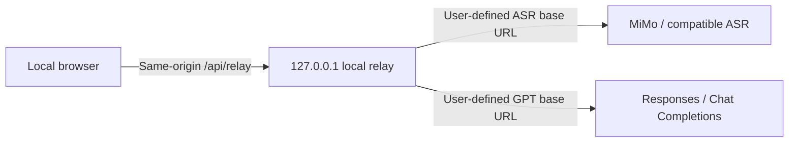

<p align="center">
  <a href="./README.md">简体中文</a> · <strong>English</strong>
</p>

<p align="center">
  
</p>

# Yanlan

> The open-source Agent Harness for recording-to-transcript and evidence-backed meeting intelligence.

[](https://github.com/ranxi2001/yanlan-ai/actions/workflows/ci.yml)
[](./LICENSE)

[Live demo](https://onefly.top/yanlan-ai/) · [Report an issue](https://github.com/ranxi2001/yanlan-ai/issues/new/choose) · [Contribute](./CONTRIBUTING.md)

Yanlan is a browser-first, self-hostable recording, transcription, and meeting-intelligence workspace. It is not a transcript UI with an LLM summary button attached. Its trusted processing core is an application-owned Agent Harness: initial ASR, quality gates, recovery, and export remain controlled pipelines outside the Harness; `gpt-5.6-luna` chooses tools and resolves ambiguity in terminology supervision and meeting analysis; `mimo-v2.5-asr` provides initial transcription and is exposed as a controlled short-audio review tool only to the terminology profile; deterministic runtime code owns fact validation and the final commit.

**Our goal is to make Yanlan the first-choice open-source Agent Harness for recording-to-knowledge workflows.**

## Why Yanlan Is an Agent Harness

A model wrapper asks a model for an answer. An Agent Harness owns the control loop around that model: typed Responses items, strict tools, exact `call_id` correlation, immutable run state, budgets and cancellation, privacy-minimized runtime metadata traces, completion invariants, and deterministic finalizers.

That boundary is central to Yanlan. Luna can choose the next allowlisted tool and repair a proposal after a structured violation, but fluent model output is not accepted as fact. Transcript changes must preserve source segments, timestamps, and speaker labels. Decisions and action items must resolve to exact records in an immutable evidence ledger. When an invariant fails, the Harness rejects the proposal instead of silently publishing a partial artifact.

**The Agent decides. The Harness verifies. Runtime commits.**

| Component | Responsibility | Cannot do |
| --- | --- | --- |
| MiMo ASR | Produce the initial segmented transcript and, only for the terminology profile, review an uncertain audio range of at most 90 seconds | Commit terminology changes, meeting conclusions, or external writes |
| Luna supervisor | Reason over context replayed by the Harness, choose allowlisted tools, discover terms, resolve conflicts, and adjudicate meeting evidence | Rewrite trusted facts, fabricate citations, or bypass a finalizer |
| Yanlan Harness | Own run state, permissions, budgets, typed-item replay, tool execution, and trace | Invent missing evidence or turn a rejected proposal into a successful artifact |
| Profile finalizers | Replay a minimal terminology patch or derive a meeting artifact from verified ledger IDs; validate coverage, source identity, timeline, speaker labels, conflicts, and evidence references; then commit atomically | Fill in missing evidence, rewrite transcript meaning, or relax invariants to accommodate an answer |

## Architecture



Initial ASR and quality gates form a controlled speech pipeline. Independent canonical-spelling review and bounded meeting-evidence extraction are controlled model steps outside the Harness; runtime grounding turns their output into bounded profile inputs. Luna handles terminology conflicts and meeting-commitment decisions that require cross-evidence judgment; fixed work remains ordinary code. Yanlan implements the Responses runner it needs directly, without taking a runtime dependency on LangGraph or the OpenAI Agents SDK, so the application retains control of state, permissions, evidence, and commit semantics.

## Two Agent Profiles, One Trust Boundary

| Profile | Luna can decide | Harness must verify | Committed artifact |
| --- | --- | --- | --- |
| Recording-wide terminology supervision | Read transcript windows, inspect terminology signals, submit or reject candidates, scan aliases, adjudicate conflicts, and optionally ask MiMo for review | Full-recording coverage, canonical uniqueness, source identity, minimal replacement, and unchanged timeline and speaker labels | Revised transcript plus a replayable correction ledger |
| Intelligent meeting analysis | Classify every decision/action candidate, then select summary, highlight, and speaker evidence from an immutable ledger | Exact candidate coverage, valid evidence IDs, quote/time/speaker-label provenance, completion conditions, and atomic commit | Title, summary, keywords, highlights, speaker notes, decisions, and action items |

Agent Mode uses the typed-item and function-call protocol of the Responses API. The Chat Completions compatibility path can still perform basic correction, but it does not provide this tool-loop contract. Interview reports currently use bounded batches plus deterministic evidence checks, while the CLI and Agent Skill currently perform transcription only; Yanlan does not present them as a third Agent profile that has not been built.

The executable Harness contract lives in code and tests:

- A runner can finish only when the response is complete, no call is pending, and the profile completion condition holds; a terminal tool can end a run directly
- Every function tool uses strict JSON Schema, receives local argument validation, and preserves the model-provided `call_id`
- Model-turn, tool-call, token, history, and time budgets plus cancellation signals bound execution; insufficient budget cannot leave half of a side-effect batch committed
- Reasoning, function-call, and function-output items are replayed intact across turns, while profile state is updated immutably
- Traces retain bounded runtime metadata such as turns, tools, identifiers, audio ranges, validation status, and usage, not API keys, raw audio, or complete transcript bodies

Inspect the implementation directly: [Harness](./src/agent/harness.js), [tool registry](./src/agent/tool-registry.js), [terminology profile](./src/agent/profiles/terminology.js), [meeting profile](./src/agent/profiles/meeting-analysis.js), and [runtime contract tests](./test/agent-harness.test.mjs).

## Built to Become the Open-Source Reference

This position has to be earned through an inspectable control path, real-recording evaluations, and sustained iteration, not declared by a README badge. Yanlan already has the foundations:

- **The complete control path is open source.** The web workspace, Agent loop, both profiles, deterministic finalizers, CLI, Skill, and evaluation harness live in one repository instead of exposing only a UI shell
- **Evidence comes before prompting.** Models submit proposals; runtime code validates facts. Raw ASR, revised transcripts, correction ledgers, and meeting artifacts remain traceably connected
- **The application owns Agent authority.** A model cannot swap itself, expand its tools, read arbitrary files, or commit an artifact directly; failures stop in an auditable state
- **Local-first BYOK product design.** Recording and export work without a key. Audio lives in IndexedDB, workspace state in localStorage, and model data goes only to APIs configured by the user
- **Web, CLI, and Agent Skill distribution.** The complete workspace serves people, the one-shot CLI serves scripts, and the Skill exposes the same transcription path to clients that support Agent Skills
- **Evaluation is part of the product.** The repository includes fake Responses contract tests, a real-meeting terminology fixture, a public semantic canary, browser E2E, and privacy and race tests. More than “the model looked good” can be reproduced

## Product Surface


| Surface | What is implemented |
| --- | --- |
| Recording and recovery | Browser recording, near-real-time segmented transcription, continuous IndexedDB commits, and recovery after refresh; if live ASR falls behind, replay persisted audio instead of accumulating PCM in memory; recording, playback, and export work without an API key |
| File transcription | Incrementally decode common audio formats up to four hours in a Dedicated Worker; apply a backpressured MiMo pipeline, quality gates, timeouts, and backoff; retain the recording when processing stops |
| Trustworthy meeting knowledge | Recording-wide terminology consistency, overview, keywords, replayable highlights, speaker notes, quote-backed decisions and actions, and question-relevant transcript retrieval; likely boundary duplicates are conservatively collapsed only in a reversible display projection while facts and exports stay unchanged |
| Interview mode | Capture candidate alias, role, round, competencies, and job description; organize quotes, gaps, and follow-up questions by competency with timestamp replay; never score abilities or advance/reject a candidate automatically |
| Share and export | Local playback with timestamp seeking; export original audio, Markdown, WebVTT, JSON, or standalone HTML; generate a read-only page with transcript, time, and summary; bound long workspace transcripts and standalone HTML to 180-row windows and 200-row pages respectively |
| BYOK boundaries | Direct browser calls or a local same-origin relay; test MiMo/GPT settings before saving; require HTTPS remotely; keep keys and meeting state in localStorage, audio in IndexedDB, and per-ID tombstones to prevent stale-tab resurrection |

See Xiaomi's official [MiMo-V2.5-ASR repository](https://github.com/XiaomiMiMo/MiMo-V2.5-ASR) for model and deployment details. The web app fixes MiMo ASR to the official Chat Completions format, sending audio as a data URL with `asr_options`, so users no longer select a protocol or enter an endpoint path. The CLI retains a standard OpenAI Transcriptions mode for compatible gateways.

The MiMo web path uses [Mediabunny](https://mediabunny.dev/guide/reading-media-files) in a Dedicated Worker for incremental container reads and WebCodecs decoding. Compressed-source cache is fixed at 4 MiB, decoded frames are continuously downsampled inside the Worker, and only 30 seconds of 16 kHz PCM is accumulated; decoding advances only when one of two MiMo request slots is free. A one-hour recording is therefore never expanded into a recording-wide `AudioBuffer`. The default limit is four hours and 512 MiB, and the browser must support the file's codec through `AudioDecoder`. If streaming is unavailable, the compatibility whole-file request is limited to files with a known duration of at most 30 minutes and a size of at most 40 MiB; longer files stop safely and remain stored locally. Current Chrome or Edge is recommended. The CLI can still select standard OpenAI Transcriptions with a compatible provider.

## Recommended Providers

- Text model: the OpenAI-compatible endpoint provided by [ai.tosky.top](https://ai.tosky.top/) is recommended; it explicitly allows the `https://onefly.top` origin for browser CORS requests.
- Speech model: register through the [dedicated Xiaomi MiMo link](https://platform.xiaomimimo.com?ref=6ENEDG) and select `mimo-v2.5-asr`.
- MiMo referral code: `6ENEDG`. Registration through the dedicated link gives both parties RMB 10 in API trial credit and provides 10% off the first purchase. Trial credit is valid for 40 days.

The MiMo URL is a referral link. Its reward terms are listed above so you can make an informed choice; Yanlan also works with compatible providers configured by the user.

## CLI: Transcribe an Audio File

When you only need text from one recording, there is no need to start the web app. With Node.js 20.19 or later, run:

```bash
export MIMO_API_KEY="your-key"
npx --yes github:ranxi2001/yanlan-ai#v0.6.2 transcribe recording.mp3 -o recording.txt
```

You can also install the CLI globally:

```bash
npm install --global github:ranxi2001/yanlan-ai#v0.6.2
yanlan transcribe interview.m4a -o interview.md --language en
```

The CLI defaults to `mimo-v2.5-asr` at `https://api.xiaomimimo.com/v1`. It accepts MP3, WAV, M4A, WebM, OGG, Opus, AAC, FLAC, and MP4 files and produces `text`, `markdown`, or `json`. Set `MIMO_BASE_URL` to use a compatible gateway. The default `mimo-chat` data-URL protocol rejects files over 40 MiB before reading them; split/compress larger files or use `--protocol openai-transcriptions` with a compatible provider. Keep credentials in environment variables so real keys do not enter your shell history. The CLI never overwrites the input audio and rejects existing outputs by default; use `--force` only after confirming that a non-input output file should be replaced.

```bash
yanlan transcribe --help
yanlan transcribe meeting.wav -o meeting.json --format json --language auto
```

Audio is sent only to the MiMo-compatible API selected by the user and never passes through a Yanlan-hosted server. The CLI does not generate summaries, correct terminology, or infer speakers; it is intended for scripts, pipelines, and one-off transcription.

## Agent Skill

Clients that support Agent Skills can install the bundled `yanlan-transcribe` skill directly:

```bash
npx skills add ranxi2001/yanlan-ai
```

Then invoke it from an agent:

```text
Use $yanlan-transcribe to transcribe /absolute/path/interview.m4a and save Markdown beside it.
```

The skill checks Node.js and the local `MIMO_API_KEY`, invokes a pinned Yanlan CLI release, and verifies that the output file is not empty. Its source is available at [`skills/yanlan-transcribe/SKILL.md`](./skills/yanlan-transcribe/SKILL.md).

## Local Development

Node.js 20.19 or later is required.

```bash
npm install
npm run dev
```

Open `http://127.0.0.1:4173`. Recording, playback, and audio export work without model configuration. To enable transcription and AI notes, configure these fields in Settings:

1. The MiMo ASR API key; the official base URL, model, and 10-second live segmentation are prefilled and remain adjustable where applicable
2. GPT base URL, API key, model, protocol, and relative API path
3. Optional shared background and domain terms. An explicit mapping such as `Term: result binding -> ResourceBinding` is applied across the entire recording; canonical-only terms authorize automatic normalization only for repeated candidates that pass recording-wide consistency checks

Each Test button uses the current unsaved form values. The MiMo test sends a one-second low-volume WAV and the GPT test sends one minimal prompt, so both may consume a very small amount of real API usage. Testing does not save the configuration.

Choose Interview when creating a record, then provide the role context. The complete job description is sent with the transcript to the configured GPT endpoint for correction and assessment. The full job description and interviewer names are never included in shared links or offline share pages.

The MiMo base URL defaults to the service root `https://api.xiaomimimo.com`; the version and API format live in the internal relative path `v1/chat/completions`. If a legacy base URL containing `/v1` or a complete request URL is pasted, the web app normalizes it back to the service root while preserving the final `POST /v1/chat/completions` request. GPT base URLs and relative paths are still used as entered. The project has no `.env` file and does not embed API keys in source code.

New configurations use the Responses API by default, which enables Agent Mode. If the base URL already includes `/v1`, such as `https://api.openai.com/v1`, enter `responses` as the relative path to produce `POST /v1/responses`. Gateways without Responses support can use Chat Completions, but that compatibility path uses the legacy correction request without a tool loop or on-demand MiMo review. Existing browser configurations retain their selected protocol.

## CORS and the Local Relay

Frontend code cannot disable browser CORS. The live demo and static deployments use direct browser requests by default, so each model service must allow the page's origin. `no-cors`, Service Workers, and public proxies cannot safely solve arbitrary API base URLs carrying private keys.

When either model service does not support browser CORS, run Yanlan locally:

```bash
npm run local
```

Open the `http://127.0.0.1:4173` address shown in the terminal and select Local same-origin relay in Settings. The page sends requests only to its own `/api/relay`; the relay forwards each request to the complete target URL supplied for that call. MiMo and GPT can therefore use different domains, and users do not need a shared base URL.



The relay listens only on `127.0.0.1`, validates Host and Origin, accepts only `POST` API forwarding, does not follow redirects, and limits request size, response size, and timeouts. It does not log keys, audio, or transcripts and must not be deployed as a public general-purpose proxy.

## Data and Security

- Both API keys, endpoint settings, and terminology prompts are stored in the current browser's `localStorage` and remain available after refresh or restart.
- Keys are sent only to the model APIs configured by the user, never to a Yanlan-hosted server. Use Clear local keys in Settings to remove them at any time.
- Export Key produces JSON containing plaintext credentials. Keep it only on a trusted device in a controlled location. Import reads only the two keys and ignores any endpoint or other configuration fields.
- Recording chunks are committed to IndexedDB throughout capture, then atomically combined into the complete recording and removed after a normal stop.
- After an accidental close, Yanlan can recover consecutive chunks that were already committed. The final chunk of roughly one second may not yet have been emitted, so export a backup after important recordings.
- Meeting deletion permanently retains a localStorage tombstone containing only the meeting ID and deletion state before removing metadata and IndexedDB audio. It contains no title or transcript and prevents a stale tab that missed synchronization events from writing deleted content back.
- Audio segments are sent to the configured MiMo API; transcript windows are sent to the configured GPT API. The agent may request a MiMo recheck of at most 90 seconds only when terminology evidence is insufficient, under a separate call budget.
- Responses requests explicitly set `store: false`. The harness replays complete typed output locally to preserve tool context and stores a run trace without keys or transcript bodies in the meeting. Third-party gateways remain subject to their own privacy policies.
- The local relay runs only through `npm run local`. The static live version never proxies or stores user keys.
- Shared links and offline pages exclude API keys, original recordings, Q&A history, and raw ASR backups.
- Interview shares exclude the complete job description and interviewer names. They contain only the candidate alias, role, round, competencies, evidence review material, and transcript.
- Interview reports only organize transcript evidence whose timestamp, speaker, and quote survive validation. They do not infer speaker identity or determine whether a quote semantically supports a competency. Interviewers must replay and judge it manually. Never use the report for automated hiring decisions or evaluate candidates from voice, accent, or sensitive personal attributes.
- A browser-only BYOK application cannot hide keys from the page running it. Use a trusted deployment and never enter production credentials on an unfamiliar site.
- Direct browser requests require model services to allow the deployment origin through CORS. Use the bundled local same-origin relay when they do not.

## Build and Deploy

```bash
npm run build
```

The generated `dist/` directory can be deployed to GitHub Pages, Cloudflare Pages, Netlify, or any static server. The bundled Pages workflow uploads only after unit, package, full browser, and dependency-audit gates pass. Shared links store the compressed transcript in the URL fragment. Direct links work well for shorter transcripts; export an offline HTML file for longer records to avoid URL truncation by messaging clients.

## Validation

```bash
npm run check
```

Run the offline terminology-consistency regression against the bundled real cloud-native fixture:

```bash
npm run eval:terminology
```

That offline regression uses scripted candidates and validates deterministic normalization and ledger replay. To measure Luna's own discovery recall without exposing the expected canonical or aliases in its prompt, run the live Agent eval:

```bash
YANLAN_LUNA_BASE_URL="https://example.com/v1" \
YANLAN_LUNA_API_KEY="your-key" \
npm run eval:terminology:agent
```

Optionally set `MIMO_API_KEY` to expose the short-audio review tool during the eval; local `ffmpeg` is required.

The live meeting-analysis evaluation reuses the public fixture and runs a public semantic canary with gold dispositions in the same command, so an all-empty insight artifact cannot pass vacuously. It prints only privacy-safe timing, count, hash, and usage metrics, never the real meeting title, summary, or transcript body:

```bash
YANLAN_LUNA_BASE_URL="https://example.com/v1" \
YANLAN_LUNA_API_KEY="your-key" \
npm run eval:meeting:agent
```

The browser end-to-end test starts an isolated local server and generates its own audio fixture:

```bash
npm run test:browser
```

An optional local test verifies streaming windows, main-thread JS heap, and Linux Chromium process PSS (including Workers/native decoding) with a real hour-scale recording. It makes no model calls and prints only size, duration, window, and memory metrics:

```bash
YANLAN_LONG_AUDIO="/path/to/meeting.webm" npm run test:browser:long-audio
```

## Project Status

`v0.6.2` bounds long-transcript rendering end to end. The workspace uses a 180-row window with an indexed height model and resize anchoring, while standalone HTML renders at most 200 transcript rows per page; a 20,000-segment browser regression keeps the active DOM below 6,000 nodes. Adjacent text is collapsed only in the display projection when the speaker matches, provider timings overlap, source text is exactly equivalent, and conservative boundary checks pass. Every collapse retains source IDs, offsets, and hidden text and can be expanded in the workspace, shared page, or standalone HTML. Public facts, Markdown, WebVTT, and JSON remain canonical.

`v0.6.1` replaces the previous fail-fast protection for hour-scale files with a genuinely bounded streaming path. Container reads, PCM windows, MiMo concurrency, terminology audio review, and live-recording catch-up all have explicit memory limits. Two consecutive local runs against a 61:35 real WebM each covered 124 windows with a 1.83 MiB PCM-window cap, about 46.0 MiB main-thread JS-heap growth, and at most about 160.8 MiB total Chromium PSS growth, without retaining a recording-wide decoded buffer.

`v0.6.0` extends the application-owned Responses Agent Harness to two profiles: recording-wide terminology consistency and intelligent meeting analysis. Luna chooses tools, MiMo supplies controlled audio evidence, and deterministic runtime code owns evidence validation, invariants, atomic commit, and trace. Long meetings first extract bounded evidence concurrently; the meeting agent then classifies every commitment candidate before the runtime derives the confirmed decision/action set. The terminology agent uses independent spelling reviews plus conflict adjudication and requires merging only for identifier groups with spacing, case, or fused-form equivalence; close ordinary words can remain distinct. Q&A, correction retries, and summary retries are bound to a transcript version, while cross-tab tombstones abort in-flight audio work and prevent deleted meetings from being written back.

`v0.5.1` was informed by anonymized measurements from a 61-minute real meeting and added large-file preflight rejection, ASR quality gates with adaptive retries, stable timeline ordering, auditable terminology patches, concurrent long-form summaries, complete transcript-backed evidence, and recording recovery consistency fixes.

The next priorities include speaker diarization, transcript editing, collaborative annotations, team permissions, and more model integrations. Roadmap discussions and priorities are maintained in GitHub Issues.

The [competitive architecture study](./docs/competitive-architecture.md) documents the product, open-source speech, and Agent/MCP trade-offs behind that roadmap (currently in Chinese).

## License

[MIT](./LICENSE). Browser streaming uses Mediabunny under MPL-2.0; see the [third-party notices](./public/THIRD_PARTY_NOTICES.txt).
