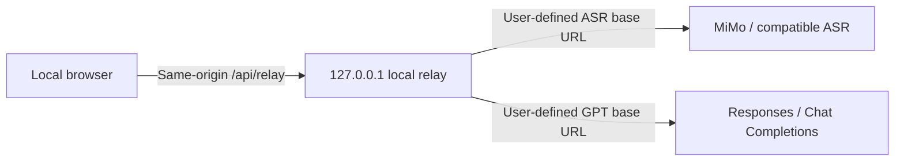

<p align="center">
  <a href="./README.md">简体中文</a> · <strong>English</strong>
</p>

<p align="center">
  
</p>

# Yanlan

> Turn every conversation into traceable knowledge.

[](https://github.com/ranxi2001/yanlan-ai/actions/workflows/ci.yml)
[](./LICENSE)

[Live demo](https://onefly.top/yanlan-ai/) · [Report an issue](https://github.com/ranxi2001/yanlan-ai/issues/new/choose) · [Contribute](./CONTRIBUTING.md)

Yanlan is an open-source, self-hostable AI audio workspace that runs entirely in the browser and supports both general meetings and interview-specific workflows. It uses a dual-model pipeline: MiMo transcribes the audio, while GPT uses meeting or role context to correct domain terms and inconsistencies before producing meeting notes or an interview review packet backed by timestamped evidence. The default text model is `gpt-5.6-luna`, called through the Responses API.


## Features

- Record in the browser, transcribe in near real time by segment, and continuously commit audio chunks to IndexedDB so persisted audio can be recovered after an accidental refresh
- Use Yanlan as a local recorder without any API key, then play or export the audio directly
- Upload and chunk common audio formats; the default MiMo data-URL path mixes only the current PCM range instead of duplicating the entire decoded recording
- Preserve raw ASR segments; GPT may adjust punctuation/case or substitute complete terms explicitly labeled with fields such as `Term:`, `Project:`, or `Name:`, but cannot change the timeline or speaker attribution, and other text rewrites are rejected
- Generate an overview, keywords, replayable highlights, speaker summaries, source-backed decisions, action items, and transcript Q&A
- Enter a candidate alias, role, interview round, competencies, and job description before an interview
- Organize interview evidence, gaps, and follow-up questions by competency; code validates timestamps and quotes but never decides whether a quote proves a competency, and never advances/rejects a candidate
- Jump from interview evidence to the corresponding audio timestamp; only quotes found in the referenced transcript segment are shown as evidence
- Play recordings locally and seek by clicking transcript timestamps
- Export the original recording, Markdown, WebVTT, JSON, or a standalone offline HTML page
- Generate a read-only page containing the transcript, timestamps, and summary
- Choose between direct browser requests and a local same-origin relay for user-defined API base URLs
- Require HTTPS for remote model endpoints; HTTP is accepted only for loopback hosts (`localhost`, `127.0.0.0/8`, and `[::1]`)
- Store recordings in IndexedDB and workspace data in localStorage
- Import and export both API keys as versioned JSON; imports cannot change model endpoints or other settings
- Retry transient MiMo failures with timeouts and backoff; if any live segment still fails, stop before generating incomplete notes and keep the recording for retranscription
- Process long transcripts in bounded summary/interview batches and retrieve question-relevant time ranges for Q&A instead of sending the whole meeting in one prompt

See Xiaomi's official [MiMo-V2.5-ASR repository](https://github.com/XiaomiMiMo/MiMo-V2.5-ASR) for model and deployment details. The web app fixes MiMo ASR to the official Chat Completions format, sending audio as a data URL with `asr_options`, so users no longer select a protocol or enter an endpoint path. The CLI retains a standard OpenAI Transcriptions mode for compatible gateways.

The default MiMo browser upload path accepts files up to 30 minutes and 128 MiB; fallback whole-file uploads are capped at 40 MiB when the browser cannot decode a file. Split longer recordings or use live recording; the CLI can select standard OpenAI Transcriptions with a compatible provider. These bounds prevent native browser decoding from exhausting memory; provider-side limits still apply.

## Recommended Providers

- Text model: the OpenAI-compatible endpoint provided by [ai.tosky.top](https://ai.tosky.top/) is recommended.
- Speech model: register through the [dedicated Xiaomi MiMo link](https://platform.xiaomimimo.com?ref=6ENEDG) and select `mimo-v2.5-asr`.
- MiMo referral code: `6ENEDG`. Registration through the dedicated link gives both parties RMB 10 in API trial credit and provides 10% off the first purchase. Trial credit is valid for 40 days.

The MiMo URL is a referral link. Its reward terms are listed above so you can make an informed choice; Yanlan also works with compatible providers configured by the user.

## CLI: Transcribe an Audio File

When you only need text from one recording, there is no need to start the web app. With Node.js 20.19 or later, run:

```bash
export MIMO_API_KEY="your-key"
npx --yes github:ranxi2001/yanlan-ai#v0.4.6 transcribe recording.mp3 -o recording.txt
```

You can also install the CLI globally:

```bash
npm install --global github:ranxi2001/yanlan-ai#v0.4.6
yanlan transcribe interview.m4a -o interview.md --language en
```

The CLI defaults to `mimo-v2.5-asr` at `https://api.xiaomimimo.com/v1`. It accepts MP3, WAV, M4A, WebM, OGG, Opus, AAC, FLAC, and MP4 files and produces `text`, `markdown`, or `json`. Set `MIMO_BASE_URL` to use a compatible gateway. The default `mimo-chat` data-URL protocol rejects files over 40 MiB before reading them; split/compress larger files or use `--protocol openai-transcriptions` with a compatible provider. Keep credentials in environment variables so real keys do not enter your shell history. The CLI never overwrites the input audio and rejects existing outputs by default; use `--force` only after confirming that a non-input output file should be replaced.

```bash
yanlan transcribe --help
yanlan transcribe meeting.wav -o meeting.json --format json --language auto
```

Audio is sent only to the MiMo-compatible API selected by the user and never passes through a Yanlan-hosted server. The CLI does not generate summaries, correct terminology, or infer speakers; it is intended for scripts, pipelines, and one-off transcription.

## Agent Skill

Clients that support Agent Skills can install the bundled `yanlan-transcribe` skill directly:

```bash
npx skills add ranxi2001/yanlan-ai
```

Then invoke it from an agent:

```text
Use $yanlan-transcribe to transcribe /absolute/path/interview.m4a and save Markdown beside it.
```

The skill checks Node.js and the local `MIMO_API_KEY`, invokes a pinned Yanlan CLI release, and verifies that the output file is not empty. Its source is available at [`skills/yanlan-transcribe/SKILL.md`](./skills/yanlan-transcribe/SKILL.md).

## Local Development

Node.js 20.19 or later is required.

```bash
npm install
npm run dev
```

Open `http://127.0.0.1:4173`. Recording, playback, and audio export work without model configuration. To enable transcription and AI notes, configure these fields in Settings:

1. The MiMo ASR API key; the official base URL, model, and 10-second live segmentation are prefilled and remain adjustable where applicable
2. GPT base URL, API key, model, protocol, and relative API path
3. Optional shared background plus domain terms explicitly labeled with fields such as `Term:`, `Project:`, or `Name:`

Choose Interview when creating a record, then provide the role context. The complete job description is sent with the transcript to the configured GPT endpoint for correction and assessment. The full job description and interviewer names are never included in shared links or offline share pages.

The MiMo base URL defaults to the service root `https://api.xiaomimimo.com`; the version and API format live in the internal relative path `v1/chat/completions`. If a legacy base URL containing `/v1` or a complete request URL is pasted, the web app normalizes it back to the service root while preserving the final `POST /v1/chat/completions` request. GPT base URLs and relative paths are still used as entered. The project has no `.env` file and does not embed API keys in source code.

New configurations use the Responses API by default. If the base URL already includes `/v1`, such as `https://api.openai.com/v1`, enter `responses` as the relative path to produce `POST /v1/responses`. Compatible gateways without Responses support can use Chat Completions instead. Existing browser configurations retain their selected protocol.

## CORS and the Local Relay

Frontend code cannot disable browser CORS. The live demo and static deployments use direct browser requests by default, so each model service must allow the page's origin. `no-cors`, Service Workers, and public proxies cannot safely solve arbitrary API base URLs carrying private keys.

When either model service does not support browser CORS, run Yanlan locally:

```bash
npm run local
```

Open the `http://127.0.0.1:4173` address shown in the terminal and select Local same-origin relay in Settings. The page sends requests only to its own `/api/relay`; the relay forwards each request to the complete target URL supplied for that call. MiMo and GPT can therefore use different domains, and users do not need a shared base URL.



The relay listens only on `127.0.0.1`, validates Host and Origin, accepts only `POST` API forwarding, does not follow redirects, and limits request size, response size, and timeouts. It does not log keys, audio, or transcripts and must not be deployed as a public general-purpose proxy.

## Data and Security

- Both API keys, endpoint settings, and terminology prompts are stored in the current browser's `localStorage` and remain available after refresh or restart.
- Keys are sent only to the model APIs configured by the user, never to a Yanlan-hosted server. Use Clear local keys in Settings to remove them at any time.
- Export Key produces JSON containing plaintext credentials. Keep it only on a trusted device in a controlled location. Import reads only the two keys and ignores any endpoint or other configuration fields.
- Recording chunks are committed to IndexedDB throughout capture, then atomically combined into the complete recording and removed after a normal stop.
- After an accidental close, Yanlan can recover consecutive chunks that were already committed. The final chunk of roughly one second may not yet have been emitted, so export a backup after important recordings.
- Audio segments are sent to the configured MiMo API; transcripts are sent to the configured GPT API.
- Responses requests explicitly set `store: false` and do not use server-side session state. Third-party gateways remain subject to their own privacy policies.
- The local relay runs only through `npm run local`. The static live version never proxies or stores user keys.
- Shared links and offline pages exclude API keys, original recordings, Q&A history, and raw ASR backups.
- Interview shares exclude the complete job description and interviewer names. They contain only the candidate alias, role, round, competencies, evidence review material, and transcript.
- Interview reports only organize candidate evidence whose timestamp and quote survive validation; they do not determine whether the quote semantically supports a competency. Interviewers must replay and judge it manually. Never use the report for automated hiring decisions or evaluate candidates from voice, accent, or sensitive personal attributes.
- A browser-only BYOK application cannot hide keys from the page running it. Use a trusted deployment and never enter production credentials on an unfamiliar site.
- Direct browser requests require model services to allow the deployment origin through CORS. Use the bundled local same-origin relay when they do not.

## Build and Deploy

```bash
npm run build
```

The generated `dist/` directory can be deployed to GitHub Pages, Cloudflare Pages, Netlify, or any static server. Shared links store the compressed transcript in the URL fragment. Direct links work well for shorter transcripts; export an offline HTML file for longer records to avoid URL truncation by messaging clients.

## Validation

```bash
npm run check
```

The browser end-to-end test starts an isolated local server and generates its own audio fixture:

```bash
npm run test:browser
```

## Project Status

`v0.4.6` adds incremental recording persistence and crash recovery, ASR retries and completeness gating, bounded GPT corrections, transcript-backed evidence validation, long-content batching, audio memory boundaries, protected CLI outputs, and browser E2E coverage in CI. `v0.4.5` introduced the audio transcription CLI and Agent Skill. `v0.4.4` added the teal brand identity. `v0.4.3` enabled keyless local recording and persistent browser API settings. `v0.4.0` added meeting highlights, speaker summaries, traceable decisions, and the local same-origin relay. `v0.3.0` adopted `gpt-5.6-luna` and the Responses API by default. `v0.2.0` introduced the interview workflow, competency evidence, follow-up questions, and privacy-trimmed interview shares.

The next priorities include speaker diarization, transcript editing, collaborative annotations, team permissions, and more model integrations. Roadmap discussions and priorities are maintained in GitHub Issues.

## License

[MIT](./LICENSE)
