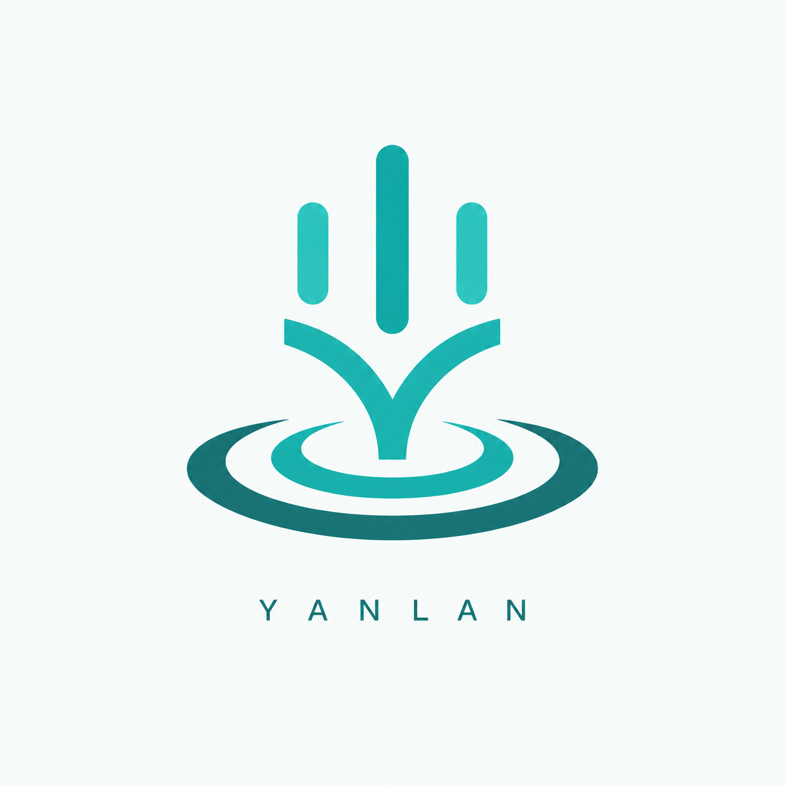
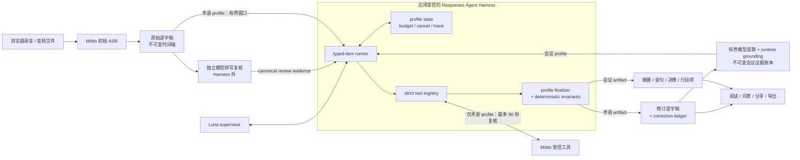
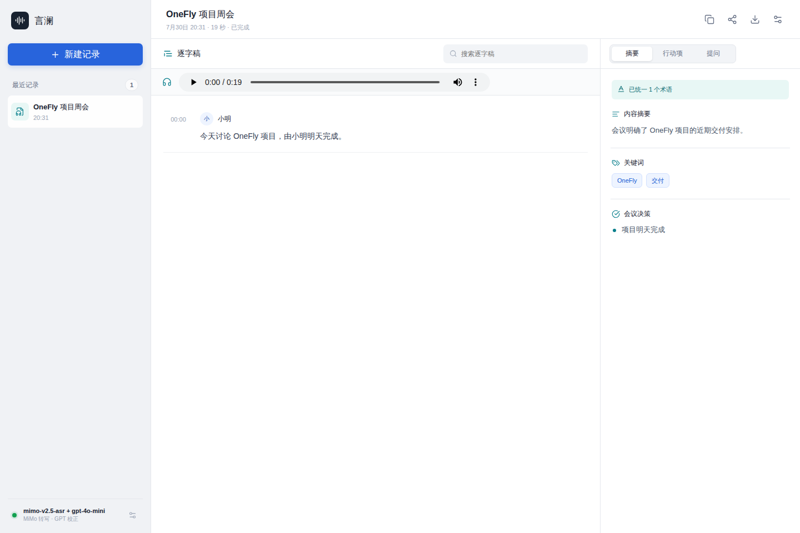
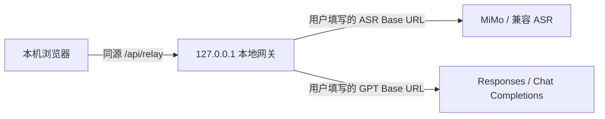

<p align="center">
  <strong>简体中文</strong> · <a href="./README.en.md">English</a>
</p>

<p align="center">
  
</p>

# 言澜 Yanlan

> 面向录音转文字与可信会议知识的开源 Agent Harness。

[](https://github.com/ranxi2001/yanlan-ai/actions/workflows/ci.yml)
[](./LICENSE)

[在线体验](https://onefly.top/yanlan-ai/) · [报告问题](https://github.com/ranxi2001/yanlan-ai/issues/new/choose) · [参与贡献](./CONTRIBUTING.md)

言澜是一个浏览器优先、可自行部署的录音转文字与智能会议工作台。它不是在逐字稿后面接一个“总结按钮”。产品以应用掌控的 Agent Harness 为可信处理核心：初始 ASR、质量门、恢复和导出保留为 Harness 外的受控数据管线；`gpt-5.6-luna` 在术语监督与会议解析中选择工具、处理歧义；`mimo-v2.5-asr` 负责初始转写，也只在术语 profile 中作为受控短音频复核工具；确定性 runtime 掌握事实校验和最终提交权。

**我们的目标：成为录音转文字 Agent Harness 领域的开源第一选择。**

## 为什么是 Agent Harness

普通模型封装只负责“问模型要一个答案”。Agent Harness 掌握模型外面的完整控制循环：typed Responses items、严格工具、精确 `call_id`、不可变运行状态、预算与取消、隐私最小化的运行元数据 trace、完成条件，以及确定性 finalizer。

这条边界是言澜的核心产品设计。Luna 可以自主决定下一步调用哪个白名单工具，也可以根据 violation 继续修正；但流畅的模型输出不等于事实。逐字稿修改必须保留来源片段、时间轴和说话人标签，决策与行动项必须回指不可变证据账本中的精确记录。任何不变量失败时，Harness 都会拒绝提案并返回结构化错误，不会静默发布半成品。

**Agent 决策，Harness 验证，runtime 提交。**

| 单元 | 负责 | 无权做 |
| --- | --- | --- |
| MiMo ASR | 初始分段转写；仅按术语 profile 请求复核本会议中不超过 90 秒的疑难音频 | 提交术语修改、会议结论或外部写入 |
| Luna supervisor | 基于 Harness 回放的上下文推理、选择白名单工具、发现术语、处理冲突、裁决会议证据 | 改写受信事实、伪造引用、绕过 finalizer |
| Yanlan Harness | 持有 run state、权限、预算、typed-item 回放、工具执行和 trace | 猜测缺失证据，或把失败提案包装成成功 |
| profile finalizers | 重放术语最小 patch，或从已验证账本 ID 派生会议 artifact；验证覆盖率、来源一致性、时间轴、说话人标签、冲突和证据引用，再原子提交 | 替模型补写缺失证据、改写逐字稿语义，或放宽不变量迁就结果 |

## 架构



初始 ASR 与质量门是受控语音管线；独立 canonical 拼写复核和有界会议证据提取是 Harness 外的受控模型步骤，其结果经过 runtime grounding 后才成为 profile 输入。真正需要跨证据判断的术语冲突与会议承诺裁决交给 Luna；固定步骤继续使用普通函数。言澜直接实现所需的 Responses runner，不依赖 LangGraph 或 OpenAI Agents SDK 作为运行时，因此应用始终掌握状态、权限、证据和提交语义。

## 两个 Agent Profile，一条可信边界

| Profile | Luna 自主完成 | Harness 强制验证 | 提交产物 |
| --- | --- | --- | --- |
| 录音级术语监督 | 读取逐字稿窗口、检查术语信号、提交或拒绝候选、扫描 alias、裁决冲突，必要时调用 MiMo 复核 | 全录音覆盖、canonical 唯一性、来源一致性、最小替换、时间轴与说话人标签不变 | 修订逐字稿和可回放 correction ledger |
| 智能会议解析 | 逐条分类决定/行动候选，再从不可变账本选择摘要、金句和发言人证据 | 候选精确覆盖、证据 ID 合法、原话/时间/说话人标签来源、完成条件与原子提交 | 标题、摘要、关键词、金句、发言人要点、决策和行动项 |

Agent Mode 只使用 Responses API 的 typed-item/function-call 协议。兼容 Chat Completions 的路径仍可完成基础校正，但不具备这套工具循环语义。面试报告当前使用有界批处理和确定性证据校验，CLI 与 Agent Skill 当前只负责音频转写；README 不把它们包装成尚未实现的第三个 Agent profile。

Harness 的可执行 contract 已写入代码和测试：

- Runner 只有在 response 完成、没有 pending call 且 profile 满足完成条件时才允许结束；terminal tool 可以直接结束 run
- 每个 function tool 使用严格 JSON Schema，本地再次校验参数，并原样关联模型给出的 `call_id`
- model turn、tool call、token、history、时间和取消信号共同限制运行；预算不足时不会先执行一半副作用
- reasoning、function call 和 function output items 在多轮中完整回放，profile state 使用不可变更新
- trace 记录有界运行元数据，例如轮次、工具、标识符、音频范围、验证状态和用量；不记录 API Key、原始音频或完整逐字稿正文

核心实现可以直接检查：[Harness](./src/agent/harness.js)、[tool registry](./src/agent/tool-registry.js)、[术语 profile](./src/agent/profiles/terminology.js)、[会议 profile](./src/agent/profiles/meeting-analysis.js) 和 [runtime contract tests](./test/agent-harness.test.mjs)。

## 为什么它有成为开源第一选择的潜力

这个目标要靠可检查的控制路径、真实录音评测和长期迭代赢得，而不是靠 README 自封排名。言澜已经具备几项关键基础：

- **完整控制路径开源**：网页工作台、Agent loop、两个 profile、确定性 finalizer、CLI、Skill 和 eval harness 都在同一个仓库，而不是只公开 UI 壳
- **证据优先，而非提示词优先**：模型提出候选，runtime 验证事实；原始 ASR、修订稿、术语台账和会议 artifact 保持可追溯关系
- **应用拥有 Agent 权限**：模型不能动态换模型、扩大工具范围、读取任意文件或直接提交 artifact；失败会停在可审计状态
- **本地优先的 BYOK 产品**：无 Key 也能录音和导出；录音保存在 IndexedDB，会议状态保存在 localStorage，模型数据只发往用户配置的 API
- **覆盖 Web、CLI 与 Agent Skill**：完整会议工作台服务人，一次性转写 CLI 服务脚本，Skill 让支持 Agent Skills 的客户端直接复用同一能力
- **评测也是产品的一部分**：仓库包含 fake Responses contract tests、真实会议术语 fixture、公开语义 canary、浏览器 E2E 和隐私/竞态测试，可重复验证的不只是“模型看起来不错”

## 产品能力



| 场景 | 已实现能力 |
| --- | --- |
| 录音与恢复 | 浏览器录音、分段近实时转写、IndexedDB 持续落盘、刷新后恢复已提交分片；实时 ASR 落后时从落盘录音补全，不在内存堆积 PCM；无需 API Key 也能录音、播放和导出 |
| 文件转写 | Dedicated Worker 增量解码最长 4 小时的常见音频；使用有背压的 MiMo 分片、质量门、超时和退避重试；失败时停止生成不完整纪要并保留录音供重转 |
| 可信会议知识 | 录音级术语统一、会议概览、关键词、可回听金句、发言人要点、带原话证据的决策/行动项和相关片段问答；逐字稿版本变化会使下游结果失效并重新生成 |
| 面试模式 | 录入候选人代称、岗位、轮次、能力项和 JD；按能力项整理原话证据、缺口与下一轮追问，点击时间点回听；不自动判断能力，也不自动推进或淘汰候选人 |
| 分享与导出 | 本地播放器与时间戳跳转；导出原始录音、Markdown、WebVTT、JSON 和离线 HTML；生成包含逐字稿、时间和摘要的只读链接 |
| BYOK 与边界 | 浏览器直连或本地同源网关；MiMo/GPT 配置保存前可测试；远程端点强制 HTTPS；Key 与会议状态保存在 localStorage，录音保存在 IndexedDB，删除由 per-ID tombstone 防止旧标签页复活 |

MiMo-V2.5-ASR 的模型能力和部署信息见小米官方的 [MiMo-V2.5-ASR 仓库](https://github.com/XiaomiMiMo/MiMo-V2.5-ASR)。网页端固定使用官方 Chat Completions ASR 格式，通过 data URL 发送音频和 `asr_options`，不再要求用户选择协议或填写请求路径；CLI 仍保留标准 OpenAI Transcriptions 协议，便于连接兼容网关。

MiMo 网页路径使用 [Mediabunny](https://mediabunny.dev/guide/reading-media-files) 在 Dedicated Worker 中增量读取容器，并通过 WebCodecs 解码。压缩源缓存固定为 4 MiB，解码帧在 Worker 内连续降采样，16 kHz PCM 只累计 30 秒窗口；生产者仅在两个 MiMo 请求槽位有空间时继续解码。因此一小时录音不会在浏览器中展开为整场 `AudioBuffer`。默认上限为 4 小时、512 MiB；当前浏览器必须支持对应音频 codec 的 `AudioDecoder`。流式能力不可用时，只有时长已知且不超过 30 分钟、文件不超过 40 MiB 的输入允许兼容整文件请求，长文件会安全停止并保留本机录音。推荐最新版 Chrome 或 Edge；CLI 仍可在兼容服务上切换到标准 OpenAI Transcriptions 协议。

## 推荐配置

- 文本模型：推荐使用 [ai.tosky.top](https://ai.tosky.top/) 提供的 OpenAI 兼容接口；该服务已将本站 Origin `https://onefly.top` 加入浏览器跨域访问白名单。
- 语音模型：推荐使用 [小米 MiMo 开放平台专属注册链接](https://platform.xiaomimimo.com?ref=6ENEDG)，ASR 模型为 `mimo-v2.5-asr`。
- MiMo 邀请码：`6ENEDG`。通过专属链接注册，双方各得 10 元 API 体验金，首单 9 折；体验金有效期 40 天。

## CLI：音频文件转文字

只需要把一个录音文件转成文字时，不必启动网页。Node.js 20.19 或更高版本可以直接运行：

```bash
export MIMO_API_KEY="你的 Key"
npx --yes github:ranxi2001/yanlan-ai#v0.6.1 transcribe recording.mp3 -o recording.txt
```

也可以全局安装：

```bash
npm install --global github:ranxi2001/yanlan-ai#v0.6.1
yanlan transcribe interview.m4a -o interview.md --language zh
```

CLI 默认调用 `https://api.xiaomimimo.com/v1` 的 `mimo-v2.5-asr`，支持 MP3、WAV、M4A、WebM、OGG、Opus、AAC、FLAC 和 MP4。输出格式为 `text`、`markdown` 或 `json`，可通过 `MIMO_BASE_URL` 连接兼容网关。默认 `mimo-chat` data URL 协议在读取前拒绝超过 40 MiB 的文件；请先切分/压缩，或在兼容服务上使用 `--protocol openai-transcriptions`。使用环境变量保存 Key，避免将真实 Key 写进命令历史。CLI 不会覆盖输入音频，默认也拒绝覆盖已有输出；确认要替换非输入文件时才使用 `--force`。

```bash
yanlan transcribe --help
yanlan transcribe meeting.wav -o meeting.json --format json --language auto
```

音频仅发送给用户配置的 MiMo 兼容 API，不经过言澜托管服务器。CLI 不做总结、术语校正或说话人推断，适合脚本、流水线和一次性转写。

## Agent Skill

支持 Agent Skills 的客户端可以直接安装仓库内的 `yanlan-transcribe`：

```bash
npx skills add ranxi2001/yanlan-ai
```

安装后可在 Agent 中使用：

```text
Use $yanlan-transcribe to transcribe /absolute/path/interview.m4a and save Markdown beside it.
```

Skill 会检查 Node.js 与本机 `MIMO_API_KEY`，调用固定版本的 Yanlan CLI，并在输出后验证文件非空。Skill 本体位于 [`skills/yanlan-transcribe/SKILL.md`](./skills/yanlan-transcribe/SKILL.md)。

## 本地运行

需要 Node.js 20.19 或更高版本。

```bash
npm install
npm run dev
```

打开 `http://127.0.0.1:4173`。不配置模型也可以直接录音、播放和导出音频；需要转写与 AI 纪要时，在页面设置中分别填写：

1. MiMo ASR 的 API Key；官方 Base URL、模型和 10 秒实时分段均已预填，可按需调整
2. GPT 的 Base URL、API Key、模型名、调用协议和相对路径
3. 可选的通用背景和专有名词；`术语：result binding -> ResourceBinding` 这样的明确映射会确定性覆盖整段录音，只填写规范词时仅允许重复出现且通过整段一致性校验的候选自动统一

两组配置旁的“测试”按钮会直接使用表单中尚未保存的值。MiMo 测试发送 1 秒低音量 WAV，GPT 测试发送一句最小提示，因此会产生极少量真实 API 用量；测试不会自动保存配置。

新建记录时选择“面试”，再填写岗位上下文。完整 JD 会随逐字稿发送给配置的 GPT 以完成校正和评估；完整 JD 和面试官姓名都不会进入分享链接或离线分享网页。

MiMo Base URL 默认使用服务根地址 `https://api.xiaomimimo.com`，版本与接口格式由内部相对路径 `v1/chat/completions` 管理。粘贴带 `/v1` 的旧 Base URL 或完整请求地址时，网页会自动归一化为服务根地址，最终请求仍是 `POST /v1/chat/completions`。GPT Base URL 和相对路径仍按填写内容使用。项目没有 `.env` 文件，也不在源码中内置 Key。

新配置默认使用 Responses API，并以此开启 Agent Mode。如果 Base URL 已经包含 `/v1`（例如 `https://api.openai.com/v1`），相对路径填写 `responses`，最终请求就是 `POST /v1/responses`。不支持 Responses 的兼容网关可以切换回 Chat Completions，但该协议只走旧版兼容校正，不具备工具循环或 MiMo 按需复核；已有浏览器配置会继续沿用原协议，不会被静默覆盖。

## 跨域与本地网关

浏览器不能由前端代码关闭 CORS。在线体验和纯静态部署默认使用“浏览器直连”，模型服务必须在响应中允许当前页面的 Origin。`no-cors`、Service Worker 或公共代理都不能安全地解决带 API Key 的任意 Base URL 请求。

当任一模型服务不支持浏览器 CORS 时，在本机使用：

```bash
npm run local
```

打开终端输出的 `http://127.0.0.1:4173`，在设置中把传输模式改成“本地同源网关”。网页只请求同源的 `/api/relay`，网关再按每次请求携带的完整目标 URL 转发，因此 MiMo 与 GPT 可以使用不同域名，用户之间也不需要统一 Base URL。



本地网关仅监听 `127.0.0.1`，校验 Host 和 Origin，只接受 `POST` API 转发，不跟随重定向，并限制请求体、响应体和超时。它不会记录 Key、音频或逐字稿，也不应部署成公网通用代理。

## 数据与安全

- 两个 API Key、端点配置和术语提示保存在当前浏览器的 `localStorage`，刷新或重新打开页面后仍可使用。
- Key 只在调用时发送给用户填写的模型 API，不发送给言澜托管服务器；可随时在设置中点击“清除本机 Key”。
- “导出 Key”生成的 JSON 含有明文凭据，应只保存在可信设备和受控位置；导入只读取两组 Key，不接受文件中的 Base URL 或其他配置。
- 录音分片在录制期间持续提交到本机 IndexedDB，正常结束后合并为完整录音并清理临时分片。
- 页面意外关闭后可恢复已提交的连续分片；尚未触发保存的最后约一秒仍可能丢失，重要录音应在结束后及时导出备份。
- 删除会议时先在 localStorage 永久保留只含会议 ID 与删除状态的 tombstone，再清理元数据和 IndexedDB 音频；它不含标题或逐字稿，并用于阻止漏掉同步事件的旧标签页重新写回已删除内容。
- 音频片段会发送给配置的 MiMo API；逐字稿窗口会发送给配置的 GPT API。Agent 只有在术语证据不足时才可请求最多 90 秒的 MiMo 音频复核，并受独立调用预算限制。
- Responses 请求显式设置 `store: false`；Harness 在本机回放完整 typed output 来维持工具上下文，并把不含 Key 和逐字稿正文的运行 trace 保存在当前会议中。第三方网关仍以其自身隐私政策为准。
- 本地网关只在 `npm run local` 启动，静态在线版不会代管或保存用户 Key。
- 分享链接和离线网页不包含 API Key、原始录音、问答历史或原始 ASR 备份。
- 面试分享稿不包含完整 JD 和面试官姓名，只包含候选人代称、岗位、轮次、能力项、证据复核材料和逐字稿。
- 面试报告只整理经时间、说话人与原文校验的逐字稿证据，不推断说话人身份，也不自动判断证据与能力项的语义关系；面试官必须回听并人工判断，不得用于自动录用决定，也不得根据声音、口音或敏感个人属性判断候选人。
- 纯前端 BYOK 无法对运行页面隐藏 Key。请使用可信部署，不要在陌生站点填写生产密钥。
- 浏览器直连要求模型服务允许部署域名的 CORS；不支持时使用项目内置的本地同源网关。

## 构建与部署

```bash
npm run build
```

`dist/` 是可部署到 GitHub Pages、Cloudflare Pages、Netlify 或任意静态服务器的产物。仓库自带的 Pages workflow 只会在单测、打包、完整浏览器测试和依赖审计全部通过后上传。分享链接把压缩后的逐字稿放在 URL fragment 中，短稿适合直接分享；长稿建议导出离线 HTML，避免聊天软件截断 URL。

## 验证

```bash
npm run check
```

仓库内真实云原生片段的离线术语一致性回归：

```bash
npm run eval:terminology
```

上面的离线回归使用脚本化候选，只验证确定性归一化与台账。要测 Luna 自己的术语发现召回率，可运行不向模型泄露 canonical 或 aliases 的真实 Agent eval：

```bash
YANLAN_LUNA_BASE_URL="https://example.com/v1" \
YANLAN_LUNA_API_KEY="your-key" \
npm run eval:terminology:agent
```

可选设置 `MIMO_API_KEY`，让 Agent eval 同时开放 MiMo 短音频复核工具；需要本机可执行 `ffmpeg`。

真实会议解析评测复用公开样本，并在同一次运行中执行带 gold disposition 的公开语义 canary，防止“所有洞察为空”仍被误判为成功。报告只输出脱敏的耗时、数量、哈希和用量指标，不打印真实会议标题、摘要或逐字稿正文：

```bash
YANLAN_LUNA_BASE_URL="https://example.com/v1" \
YANLAN_LUNA_API_KEY="your-key" \
npm run eval:meeting:agent
```

浏览器端到端验收会自行启动隔离的本地服务并生成测试音频：

```bash
npm run test:browser
```

可选使用本机一小时级真实录音验证流式窗口、主线程 JS 堆和 Linux Chromium 进程 PSS（含 Worker/原生解码器）；脚本只输出大小、时长、窗口数与内存指标，不调用模型，也不输出音频或逐字稿内容：

```bash
YANLAN_LONG_AUDIO="/path/to/meeting.webm" npm run test:browser:long-audio
```

## 项目状态

`v0.6.1` 将一小时级文件转写从“提前拒绝以避免 OOM”升级为真正的有界流式链路：容器读取、PCM、MiMo 并发、术语音频复核和实时录音追赶均有明确内存上限。本机 61:35 真实 WebM 连续两次回归均覆盖 124 个窗口，PCM 窗口上限 1.83 MiB、主线程 JS 堆增长约 46.0 MiB、Chromium 总 PSS 最多增长约 160.8 MiB，不再持有整场解码音频。

`v0.6.0` 将自研 Responses Agent Harness 扩展为录音级术语一致性和智能会议解析两个 profile：Luna 负责工具选择，MiMo 提供受控音频证据，确定性 runtime 负责证据校验、不变量、原子提交和 trace。长会议先并发提取有界证据，再由会议 Agent 选择证据 ID；术语 Agent 使用独立拼写审查与冲突裁决，只强制合并具备 spacing/case/fused 等价证据的标识符，普通近似词可判为不同实体。问答、校正重试和纪要重试均绑定逐字稿版本，删除操作由跨标签 tombstone 保护，处理中不会把半成品或已删除会议写回本机。

`v0.5.1` 基于一段 61 分钟真实会议的匿名测量，增加大文件快速预检、ASR 质量门与自适应重试、稳定时间排序、可审计术语补丁、并发长总结、完整原话证据约束和录音恢复一致性修复。下一阶段继续推进说话人分离、逐字稿编辑与协作批注。

会议产品、开源语音组件与 Agent/MCP 的技术取舍见[竞品架构调研](./docs/competitive-architecture.md)。

## 开源协议

[MIT](./LICENSE)。浏览器流式音频读取使用 MPL-2.0 的 Mediabunny，详见[第三方声明](./public/THIRD_PARTY_NOTICES.txt)。
