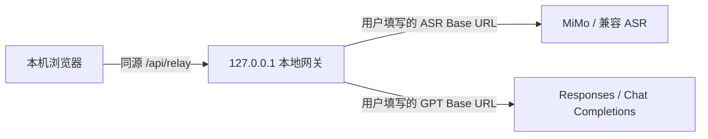

<p align="center">
  <strong>简体中文</strong> · <a href="./README.en.md">English</a>
</p>

<p align="center">
  
</p>

# 言澜 Yanlan

> 让每一次发言，都沉淀为可追溯的知识。

[](https://github.com/ranxi2001/yanlan-ai/actions/workflows/ci.yml)
[](./LICENSE)

[在线体验](https://onefly.top/yanlan-ai/) · [报告问题](https://github.com/ranxi2001/yanlan-ai/issues/new/choose) · [参与贡献](./CONTRIBUTING.md)

言澜是一个纯前端、可自行部署的开源 AI 语音记录工具，支持普通会议和面试专用模式。它采用双模型管线：MiMo 负责语音识别，GPT 结合会议或岗位上下文校正专有名词和前后不一致，再生成会议纪要或带时间证据的面试辅助评估。文本模型默认使用 `gpt-5.6-luna` 和 Responses API。


## 功能

- 浏览器录音，分段实时转写，结束后保存完整录音
- 无需 API Key 也可作为纯本地录音器使用，结束后直接播放或导出音频
- 上传常见格式的音频并转写
- 保留原始 ASR 片段，GPT 校正不改变时间轴
- 会议概览、关键词、可回听金句、发言人总结、带原话证据的关键决策、行动项和逐字稿问答
- 面试前录入候选人代称、岗位、轮次、能力项和 JD
- 面试后生成辅助结论、置信度、分能力证据、风险项和下一轮追问
- 面试证据可点击时间点回听；证据不足时保留明确标记
- 本地播放器，点击时间戳跳转到录音位置
- 导出原始录音、Markdown、WebVTT、JSON 和离线 HTML
- 生成包含逐字稿、时间和摘要的只读链接
- 浏览器直连与本地同源网关双模式，兼容不同用户配置的 API Base URL
- 录音保存在 IndexedDB，会议数据保存在 localStorage

MiMo-V2.5-ASR 的模型能力和部署信息见小米官方的 [MiMo-V2.5-ASR 仓库](https://github.com/XiaomiMiMo/MiMo-V2.5-ASR)。默认调用方式与官方 [MiMo-Code](https://github.com/XiaomiMiMo/MiMo-Code) 一致：通过 Chat Completions 发送 data URL 音频和 `asr_options`；设置中也保留了标准 OpenAI Transcriptions 协议，便于连接兼容网关。

## 推荐配置

- 文本模型：推荐使用 [ai.tosky.top](https://ai.tosky.top/) 提供的 OpenAI 兼容接口。
- 语音模型：推荐使用 [小米 MiMo 开放平台专属注册链接](https://platform.xiaomimimo.com?ref=6ENEDG)，ASR 模型为 `mimo-v2.5-asr`。
- MiMo 邀请码：`6ENEDG`。通过专属链接注册，双方各得 10 元 API 体验金，首单 9 折；体验金有效期 40 天。

## CLI：音频文件转文字

只需要把一个录音文件转成文字时，不必启动网页。Node.js 20 或更高版本可以直接运行：

```bash
export MIMO_API_KEY="你的 Key"
npx --yes github:ranxi2001/yanlan-ai#v0.4.5 transcribe recording.mp3 -o recording.txt
```

也可以全局安装：

```bash
npm install --global github:ranxi2001/yanlan-ai#v0.4.5
yanlan transcribe interview.m4a -o interview.md --language zh
```

CLI 默认调用 `https://api.xiaomimimo.com/v1` 的 `mimo-v2.5-asr`，支持 MP3、WAV、M4A、WebM、OGG、Opus、AAC、FLAC 和 MP4。输出格式为 `text`、`markdown` 或 `json`，可通过 `MIMO_BASE_URL` 连接兼容网关。使用环境变量保存 Key，避免将真实 Key 写进命令历史。

```bash
yanlan transcribe --help
yanlan transcribe meeting.wav -o meeting.json --format json --language auto
```

音频仅发送给用户配置的 MiMo 兼容 API，不经过言澜托管服务器。CLI 不做总结、术语校正或说话人推断，适合脚本、流水线和一次性转写。

## Agent Skill

支持 Agent Skills 的客户端可以直接安装仓库内的 `yanlan-transcribe`：

```bash
npx skills add ranxi2001/yanlan-ai
```

安装后可在 Agent 中使用：

```text
Use $yanlan-transcribe to transcribe /absolute/path/interview.m4a and save Markdown beside it.
```

Skill 会检查 Node.js 与本机 `MIMO_API_KEY`，调用固定版本的 Yanlan CLI，并在输出后验证文件非空。Skill 本体位于 [`skills/yanlan-transcribe/SKILL.md`](./skills/yanlan-transcribe/SKILL.md)。

## 本地运行

需要 Node.js 20 或更高版本。

```bash
npm install
npm run dev
```

打开 `http://127.0.0.1:4173`。不配置模型也可以直接录音、播放和导出音频；需要转写与 AI 纪要时，在页面设置中分别填写：

1. MiMo ASR 的 Base URL、API Key、模型名、调用协议和转写路径
2. GPT 的 Base URL、API Key、模型名、调用协议和相对路径
3. 可选的通用背景、人员姓名、项目名和专有名词

新建记录时选择“面试”，再填写岗位上下文。完整 JD 会随逐字稿发送给配置的 GPT 以完成校正和评估；完整 JD 和面试官姓名都不会进入分享链接或离线分享网页。

Base URL 会按填写内容原样使用；应用不会自动添加或删除 `/v1`。项目没有 `.env` 文件，也不在源码中内置 Key。

新配置默认使用 Responses API。如果 Base URL 已经包含 `/v1`（例如 `https://api.openai.com/v1`），相对路径填写 `responses`，最终请求就是 `POST /v1/responses`。不支持 Responses 的兼容网关可以在设置中切换回 Chat Completions；已有浏览器配置会继续沿用原协议，不会被静默覆盖。

## 跨域与本地网关

浏览器不能由前端代码关闭 CORS。在线体验和纯静态部署默认使用“浏览器直连”，模型服务必须在响应中允许当前页面的 Origin。`no-cors`、Service Worker 或公共代理都不能安全地解决带 API Key 的任意 Base URL 请求。

当任一模型服务不支持浏览器 CORS 时，在本机使用：

```bash
npm run local
```

打开终端输出的 `http://127.0.0.1:4173`，在设置中把传输模式改成“本地同源网关”。网页只请求同源的 `/api/relay`，网关再按每次请求携带的完整目标 URL 转发，因此 MiMo 与 GPT 可以使用不同域名，用户之间也不需要统一 Base URL。



本地网关仅监听 `127.0.0.1`，校验 Host 和 Origin，只接受 `POST` API 转发，不跟随重定向，并限制请求体、响应体和超时。它不会记录 Key、音频或逐字稿，也不应部署成公网通用代理。

## 数据与安全

- 两个 API Key、端点配置和术语提示保存在当前浏览器的 `localStorage`，刷新或重新打开页面后仍可使用。
- Key 只在调用时发送给用户填写的模型 API，不发送给言澜托管服务器；可随时在设置中点击“清除本机 Key”。
- 完整录音保存在本机浏览器的 IndexedDB。
- 音频片段会发送给配置的 MiMo API；逐字稿会发送给配置的 GPT API。
- Responses 请求显式设置 `store: false`，不使用服务端会话状态；第三方网关仍以其自身隐私政策为准。
- 本地网关只在 `npm run local` 启动，静态在线版不会代管或保存用户 Key。
- 分享链接和离线网页不包含 API Key、原始录音、问答历史或原始 ASR 备份。
- 面试分享稿不包含完整 JD 和面试官姓名，只包含候选人代称、岗位、轮次、能力项、辅助评估和逐字稿。
- 面试评估只应作为人工复核材料，不用于自动录用决定；不得根据声音、口音或敏感个人属性判断候选人。
- 纯前端 BYOK 无法对运行页面隐藏 Key。请使用可信部署，不要在陌生站点填写生产密钥。
- 浏览器直连要求模型服务允许部署域名的 CORS；不支持时使用项目内置的本地同源网关。

## 构建与部署

```bash
npm run build
```

`dist/` 是可部署到 GitHub Pages、Cloudflare Pages、Netlify 或任意静态服务器的产物。分享链接把压缩后的逐字稿放在 URL fragment 中，短稿适合直接分享；长稿建议导出离线 HTML，避免聊天软件截断 URL。

## 验证

```bash
npm run check
```

浏览器端到端验收需要先启动开发服务器：

```bash
npm run dev
npm run test:browser
```

## 项目状态

`v0.4.5` 发布音频转文字 CLI 与 Agent Skill；`v0.4.4` 发布青绿色品牌 Logo；`v0.4.3` 支持无 Key 本地录音与持久保存浏览器 API 配置；`v0.4.0` 增加会议金句、发言人总结、可追溯关键决策和本地同源网关；`v0.3.0` 默认使用 `gpt-5.6-luna` 和 Responses API；`v0.2.0` 增加面试专用模式、岗位能力证据、面试追问和隐私裁剪后的分享稿。下一阶段重点包括说话人分离、逐字稿编辑、协作批注、团队权限和更多模型适配。路线和优先级通过 GitHub Issues 公开维护。

## 开源协议

[MIT](./LICENSE)
