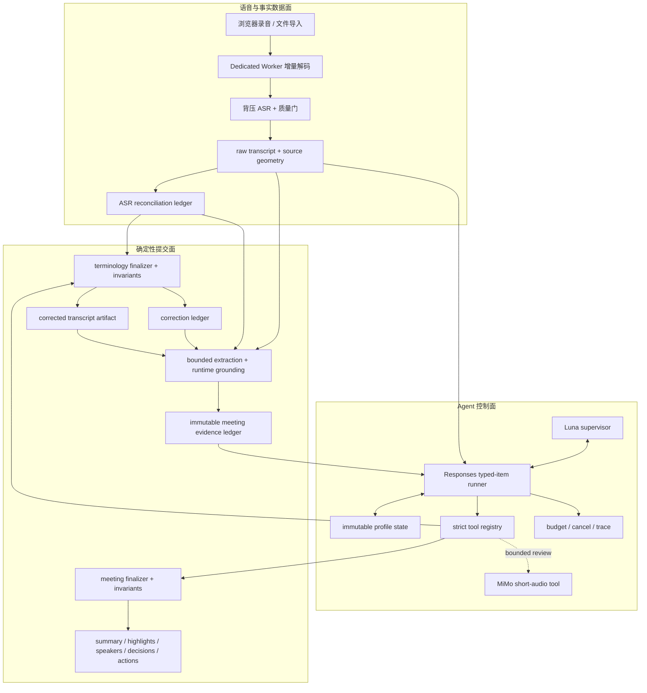
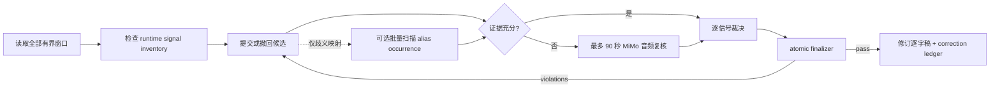

# 浏览器前端环境中的可信 Agent Harness：言澜的控制面设计、精细化实现与阶段性评估

> Yanlan Technical Report YL-TR-2026-01
>
> 系统版本：v0.6.2
>
> 源码基线：`087fe42f234bd5278bc74b3138e205369be29aab`
>
> 评估日期：2026-08-06
>
> 状态：工程技术报告，未经同行评审

## 摘要

将大语言模型接入浏览器会议产品并不等于获得一个可靠 Agent。浏览器缺少受信服务端，面对有限内存、页面刷新、跨域限制和用户自带密钥；模型输出则具有非确定性，可能产生无效工具参数、遗漏证据或虚构事实。本文以开源会议工作台言澜 Yanlan 为研究对象，讨论如何在浏览器前端实现一个由应用掌控的 Agent Harness。系统将语音数据面、Agent 控制面和确定性提交面分离：MiMo 提供初始语音识别及有界音频复核，Luna 通过 OpenAI Responses typed items 选择严格白名单工具，浏览器 runtime 持有不可变运行状态、资源预算、证据账本、profile invariant 和最终提交权。术语监督与会议解析两个 profile 分别以最小文本补丁和证据 ID 为提案单位，模型不能直接改写事实资产。

在 v0.6.2 基线上，69/69 项 Agent 聚焦契约测试和 238/238 项全仓库测试通过；离线术语 fixture 的 7/7 个目标 occurrence 被确定性统一，禁止别名残留为 0；一段 61 分 35 秒真实 WebM 的无模型流式回归产生 124 个预期窗口并解码到末端，单窗口 PCM 上限为 1,920,000 B；20,000 段逐字稿的工作台活动窗口不超过 180 行，离线页每页不超过 200 行。上述结果证明了协议、不变量和资源边界在已测条件下成立，但不能推导语音识别准确率或开放域会议理解准确率。本文因此提出分层达成率，而不使用单一综合百分比，并明确当前 benchmark、恢复能力和安全边界的局限。

**关键词：** Agent Harness；浏览器 Agent；Responses API；工具调用；证据账本；确定性 finalizer；长音频；本地优先

## 1. 引言

### 1.1 研究背景

会议智能产品通常包含录音、转写、术语校正、总结、决策与行动项提取、问答、分享和导出。若将这些能力实现为一串互不约束的模型请求，系统很难回答四个基本问题：模型看到了什么证据，为什么修改某段文本，哪一条模型输出获得了提交权，以及失败后保留了哪个一致状态。

前端实现进一步放大了这些问题。长录音不能展开为整场 `AudioBuffer`；`localStorage`、IndexedDB 和内存对象具有不同事务语义；任意第三方 Base URL 受 CORS 约束；API Key 又不应经过项目托管服务器。与此同时，模型 provider 可能返回未完成 response、重复 `call_id`、超大 tool output，甚至在 HTTP 200 下忽略工具协议。可靠性因此必须由模型外部的控制系统建立。

本文使用 **Agent Harness** 表示这一控制系统：它负责运行循环、状态、权限、预算、工具协议、证据追踪、完成条件和提交规则；模型只负责在允许的动作空间内提出下一步。

### 1.2 研究问题

本文回答以下问题：

- **RQ1：** 在没有受信云后端的浏览器环境中，如何让非确定模型参与多轮工具决策，同时保持可终止、可拒绝和可审计？
- **RQ2：** 如何使术语修改、会议总结、决策和行动项可追溯到逐字稿，而不是由流畅的自由文本直接成为事实？
- **RQ3：** 如何将一小时级音频、长逐字稿和模型上下文限制在显式资源预算内？
- **RQ4：** 当 Responses 工具能力不可用、页面被取消或局部处理失败时，系统如何可见地降级而不是伪装成功？
- **RQ5：** 如何量化工程效果，同时避免把测试通过率或小样本结果误称为模型准确率？

### 1.3 主要贡献

本文的贡献包括：

1. 提出一个适用于浏览器 BYOK 产品的三平面架构，将语音处理、Agent 决策和事实提交分离。
2. 给出 typed-item 回放、严格工具、本地参数校验、不可变状态迁移、状态工具串行化、预算和终态工具组成的最小 Responses Harness。
3. 通过术语监督和会议解析两个 profile，展示如何把领域约束编码为证据账本、结构化 violation 和确定性 finalizer。
4. 给出 Worker 流式音频、IndexedDB 增量持久化、长列表有界渲染和本机同源 relay 的浏览器工程实现。
5. 建立可复算的分层评估口径，分别报告控制协议、样本内任务、资源边界和尚未测量的模型质量。

## 2. 定义、范围与威胁模型

### 2.1 核心定义

| 术语 | 本文定义 |
| --- | --- |
| Agent | 根据当前上下文选择下一动作的模型实例；在言澜中主要指 Luna supervisor |
| Harness | 模型外部、由应用掌控的运行循环和策略执行器 |
| Profile | 某一领域任务的工具集合、状态、完成条件、finalizer 和 invariant |
| Proposal | 模型提出但尚未获得事实提交权的候选动作或引用集合 |
| Artifact | 可被产品消费和持久化的版本化结果，如修订逐字稿或会议纪要 |
| Evidence ledger | 由 runtime 构建的有界证据记录集合；模型只能引用账本中的 ID |
| Finalizer | 重放提案、验证来源与不变量，并构造最终 artifact 的确定性代码 |
| Trace | 只记录有界运行元数据的追加式事件序列，不是完整 prompt 或逐字稿日志 |

本文中的“不可变”指单次运行内对输入只读、对状态复制更新，并使用逐段 source hash 或会议级 source signature 检查来源变化；它不表示密码学不可篡改。“原子提交”指应用只暴露完整通过 finalizer 的新状态，不表示跨 `localStorage`、IndexedDB 和外部网络的分布式事务。

### 2.2 信任边界

系统信任本地发布的前端代码、确定性 validators/finalizers 和用户主动选择的配置；不信任模型生成的参数、自由文本和 provider 协议完整性。原始 ASR 也不是现实事实，只是带来源和时间几何的基线记录。Harness 能证明派生产物引用了基线证据，不能证明基线语音识别一定正确。

浏览器存储并不等于离线处理。启用转写、校正或总结后，音频或逐字稿会发送给用户配置的第三方端点。Responses 请求中的 `store:false` 是请求参数，不替代 provider 的隐私政策。系统也不防御已经控制页面脚本、浏览器 profile 或操作系统的攻击者；BYOK 场景仍需关注 XSS、扩展程序和本机凭据暴露。

### 2.3 非目标

当前系统不声称提供：

- 可恢复到任意中间模型轮次的持久化 RunState；
- 跨设备协作数据库或云端权限系统；
- 现实世界事实核验、实名说话人识别或人事决策自动化；
- 任意外部副作用的事务回滚；
- MiMo 的 WER/CER、说话人 DER 或跨领域会议理解准确率保证。

## 3. 设计原则

### 3.1 模型提案，runtime 提交

系统将模型输出视为不可信 proposal。只有 schema、来源绑定、证据覆盖、领域 invariant 和资源预算全部通过时，runtime 才构造 artifact。对当前两个 artifact profile，提交判定可概括为：

```text
Commit(P) := ResponseCompleted
          AND NoPendingToolCall
          AND ProfileComplete(State, Response)
          AND Violations(P, Evidence) = empty
          AND BudgetsNotExceeded
```

当前两个 profile 的 `ProfileComplete` 都要求 terminal state；通用 runner 也允许其他 profile 以无待处理调用且 `isComplete` 成立的 assistant message 结束。该设计把“模型是否会遵守提示词”转化为“模型是否能提出一个由程序验证的提案”。

### 3.2 Artifact 优先于聊天文本

逐字稿、校正台账、会议证据和最终纪要是相互引用的 artifact，而不是一段不断被覆盖的聊天字符串。术语 Agent 提交最小 `from -> to` patch；会议 Agent 提交 evidence ID 集合。title、summary、speaker facts、decision 和 action item 均由 runtime 从已验证记录派生。

### 3.3 领域约束属于 Profile

通用 runner 只负责协议正确性，不理解“行动项”或“专有名词”。完整逐字稿覆盖、canonical 唯一性、每个承诺候选必须分类等规则属于各自 profile。这样既避免在通用 Harness 中硬编码某个 fixture，也避免把关键约束埋进 prompt。

### 3.4 Fail closed 与显式降级

未完成 response、无效参数、重复调用 ID、预算超限、来源变更或 finalizer violation 都不会被包装成成功。provider 明确不支持 Responses 工具，或返回兼容的 HTTP 200 却忽略工具时，系统进入有界、证据约束的 fallback，并记录 `unsupported` 或 `bounded_fallback` 状态；其他错误保持失败。

### 3.5 数据最小化与本地优先

API Key 和会议状态（包括逐字稿与派生结果）保存在当前浏览器的 `localStorage`，录音与临时录音块保存在 IndexedDB。静态部署默认浏览器直连；CORS 不允许时，可使用仅监听 loopback 的同源 relay。当前内置 trace producer 只写轮次、工具、范围、状态和用量等最小元数据，不传入 Key、原始音频、完整逐字稿或 provider 错误正文；trace primitive 本身并不是任意 payload 的通用清洗器。

## 4. 系统架构

### 4.1 三平面架构



数据面负责把音频变为有来源几何的逐字稿；控制面允许模型读取有界证据并选择白名单工具；提交面重新验证 proposal 并决定是否发布 artifact。各层通过 meeting object、稳定 segment ID、逐段 source hash 和会议级 source signature 分层关联，而不是共享同一个签名字段。

### 4.2 执行时序

```mermaid
sequenceDiagram
  participant UI as Browser UI
  participant H as Harness
  participant L as Luna / Responses
  participant T as Tool Registry
  participant F as Profile Finalizer

  UI->>H: input + immutable evidence + policy
  loop bounded model turns
    H->>H: check model-turn and history budgets
    H->>L: complete typed-item history + strict tools
    L-->>H: reasoning/message/function_call items
    H->>H: validate envelope; account token budget
    alt response contains function calls
      H->>T: validate budget/call_ids; prepare whole batch
      T->>T: parse JSON + validate schema + freeze args
      alt finalize_* stateful tool
        T->>F: execute deterministic finalizer
        F-->>T: committed state or structured violations
      else ordinary profile tool
        T->>T: execute bounded profile tool
      end
      T-->>H: tool result
      H->>H: serialize output, then commit immutable state
      alt terminal state committed
        H-->>UI: result + minimized trace + usage
      else continue or repair
        H->>L: next request includes exact call_id output
      end
    else no calls and profile complete
      H-->>UI: result + minimized trace + usage
    end
  end
```

Finalizer 因而不是 loop 之外的后处理。`finalize_correction` 与 `finalize_meeting_analysis` 都是 registry 内的 stateful tool：失败 violation 作为对应 `function_call_output` 进入下一模型轮，成功 state 则由 Harness 直接以 terminal tool state 结束。

## 5. Harness 的精细化实现

### 5.1 Typed-item runner

核心 runner 位于 [`src/agent/harness.js`](../src/agent/harness.js)。它不会把 Responses 降格为字符串对话：`reasoning`、`message` 和 `function_call` items 被完整加入 history，工具结果以模型给出的精确 `call_id` 形成 `function_call_output`。只有 `status=completed` 且 `output` 为数组的 response 才能进入下一阶段。

简化算法如下：

```text
state <- deepFreeze(clone(initialState))
history <- normalize(input)
while true:
  assert model-turn and history budgets
  response <- Responses(instructions(state), history, strictTools, combinedTimeoutSignal)
  measure response usage
  assert completed typed response; retain measured usage on invalid response
  assert total-token budget
  record accepted response usage
  history <- history + response.output

  if response has calls:
    assert profile not terminal
    assert whole batch fits tool budget
    prepare and validate every call before executing any call
    assert at most one stateful call and no mixed stateful batch
    for invocation in prepared calls:
      result <- execute(invocation, frozenContext)
      assert serialized output size
      state <- deepFreeze(clone(result.state))
      history <- history + exact-call-id output
    if terminal tool committed state: return result
    continue

  if profile completion predicate holds: return result
  append bounded incomplete feedback or fail
```

Terminal tool 可以直接完成 run，避免为了获取一条形式化 assistant message 再调用一次模型。相反，模型在 terminal state 后继续请求工具会被拒绝。

### 5.2 严格工具与双重校验

[`src/agent/tool-registry.js`](../src/agent/tool-registry.js) 要求每个工具声明 `strict:true`、非空说明、executor 和递归严格的 JSON Schema。Object schema 必须设置 `additionalProperties:false`，`required` 必须覆盖所有 properties；array 必须声明 items。模型返回参数后，浏览器再次解析 JSON 并执行 enum、const、类型、长度和数值边界校验。

这形成 provider schema 约束与本地 runtime 校验两道门。注册表还区分 stateless 与 stateful tool。单个 response 最多包含一个 stateful call，且该 call 不能与其他 call 混合，从而消除现有工具在同一旧状态上的并发写竞争。`stateful` 是可信应用工具作者声明的 contract，runner 不会动态检测 executor 是否暗中改变状态；现有 stateless tools 必须遵守只读约定。

### 5.3 先验证整个批次，再执行

Harness 在执行任何工具前一次性检查整个 call batch 的预算、完成状态、非空 `call_id`、全局唯一性、工具名称和参数。若后一个调用无效，前一个调用也不会先改变 Harness state。工具执行返回后，runtime 先序列化并检查 output 字符数，随后才提交新 state。

这里的原子性仅覆盖 Harness state。Executor 内已经发生的外部写入不能由 runner 自动回滚，因此当前 finalizer 不执行不可逆外部副作用；未来外部写入工具还需要幂等键、显式授权和人审门。

### 5.4 多维预算与取消

[`src/agent/policy.js`](../src/agent/policy.js) 同时限制 model turns、tool calls、idle turns、tool output 字符、history 字符、total tokens 和 wall-clock。通用默认值分别为 12、32、1、40,000、500,000、100,000 和 300 秒，profile 可以在硬上下界内收紧或按录音规模扩容。外部 `AbortSignal` 与运行超时合并，取消会沿 tool context 传递。

单一 `maxTurns` 无法覆盖真实浏览器故障：一次工具可能产生过大输出，短轮次也可能消耗过多 token，长录音则可能需要更多窗口但仍必须限制总时间。因此预算被视为一个向量，而不是一个计数器。

### 5.5 Trace 与失败状态

[`src/agent/trace.js`](../src/agent/trace.js) 维护带 `sequence`、`run_id`、时间和类型的追加事件。失败时，runner 附加最后一个已提交的不可变 state、当前 producer 生成的最小化 trace 和 usage。Runner 的失败事件只接受受限 code，现有工具 producer 也不写 provider prose；相应回归证明当前路径不会持久化 provider 错误正文或不透明标识符。由于 `trace.append` 只复制并冻结 data 而不通用清洗内容，新增 producer 仍必须接受代码审查和隐私测试。

当前 trace 是一次运行的精简元数据，不是可恢复 checkpoint。刷新页面后不能从某一 Responses item 继续运行；产品通常只保存最近一次 `agentRun` 和最终 artifact。这一差距在第 10 节讨论。

### 5.6 Responses adapter

[`src/agent/responses-adapter.js`](../src/agent/responses-adapter.js) 显式发送 `store:false`、`parallel_tool_calls:false` 和输出 token 上限，并在无服务端存储模式下请求 encrypted reasoning item 以支持连续工具轮次。Adapter 只负责协议转换；完成条件、权限和事实语义仍由 Harness 与 profile 持有。

## 6. 领域 Profile 与证据提交

### 6.1 术语监督 Profile

术语 profile 的输入是带稳定 segment ID、时间和 speaker 的逐字稿。处理顺序如下：



[`src/agent/profiles/terminology.js`](../src/agent/profiles/terminology.js) 强制 Agent 覆盖完整逐字稿、检查 runtime 生成的信号清单、解决所有必需信号，再请求 finalization。MiMo 复核被限制为最多 4 次、每次不超过 90 秒，并绑定当前会议、signal 和 segment；模型不能传入任意 URL 或文件路径。

术语提交分为三个阶段。首先，profile 验证窗口覆盖、信号裁决和 canonical 权威，失败项只进入 state validation/trace 并返回模型修复。其次，runtime 针对固定 original 检查 occurrence、canonical、patch overlap 和关键事实，生成带 source hash 与 exact offset 的 accepted/rejected correction ledger；只有到达这一 patch 阶段的 replacement 才进入 ledger。最后，后续可信使用从 raw ASR 与 reconciliation 重放 ledger，重新检查 source hash、offset、时间和 speaker 几何；任何不一致都 fail closed。

### 6.2 会议解析 Profile

会议自由文本首先经过有界候选提取和 runtime quote grounding，形成最多 400 条的只读 evidence ledger。记录包含精确 quote、时间、speaker 和 kind；source signature 是 profile state 中独立的会议级字段，不复制到每条 record。Luna 不能直接撰写最终 title 或 summary；它必须：

1. 对每个 decision/action candidate 精确分类，不能遗漏、重复或引用未知 ID；
2. 仅从账本选择 summary、highlight 和 speaker evidence ID；
3. 请求 terminal finalizer，由 runtime 从已确认分类和引用集合构造 artifact。

[`src/agent/profiles/meeting-analysis.js`](../src/agent/profiles/meeting-analysis.js) 将候选覆盖和终态条件编码为工具协议；quote grounding 发生在建账之前，[`src/api.js`](../src/api.js) 中的 finalizer 随后检查当前 source signature、evidence ID/kind、batch 摘要覆盖、speaker 归属和关键事实，而不是再次执行 quote grounder。这提高了提交 precision 和可追溯性，但不能弥补上游候选提取遗漏，因此不保证 recall。

### 6.3 三层 provenance

当前事实链由三类账本组成：

| 层级 | 输入 | 允许变更 | 关键校验 |
| --- | --- | --- | --- |
| ASR reconciliation | raw ASR segments | 仅可证明的边界 reconciliation；普通 overlap 保留 | algorithm version、source hash、offset、时间、speaker |
| Correction ledger | 重放后的 ASR artifact | accepted/rejected 最小术语 patch | canonical、exact occurrence、critical fact fingerprint、geometry |
| Meeting evidence ledger | 修订逐字稿 | 只选证据 ID 并派生纪要 | 独立 source signature、record ID/kind、batch、speaker、candidate coverage |

显示层可以保守折叠可能重复的文本，但原始与派生事实层、Markdown、WebVTT 和 JSON 导出保持不变。用户可展开隐藏原文。这使 UI 优化不会成为不可见的数据清洗。

## 7. 浏览器工程实现

### 7.1 长音频的有界流式路径

主线程通过 [`src/audio-stream.js`](../src/audio-stream.js) 以 pull 模式驱动 Dedicated Worker，禁止并行 `next()`；取消和 dispose 会终止 Worker。[`src/audio-decode-worker.js`](../src/audio-decode-worker.js) 使用 Mediabunny/WebCodecs 增量读取容器，压缩源 cache 上限固定为 4 MiB，并将音频连续降采样至 16 kHz。Worker 每次 pull 只以 transferable `ArrayBuffer` 移交一个有界 PCM chunk；默认 chunk 为 30 秒，正常 UI 配置对应 15、30 或 45 秒。

ASR 消费端并发固定为 2，生产者只有在请求槽位释放后继续拉取下一窗口。因此，增量解码工作集（不含原始 source Blob 或浏览器文件 backing）近似为 `O(source cache + active PCM/request windows)`，不会再额外展开 recording-wide PCM。流式能力不可用时，兼容整文件路径只接受时长已知且不超过 30 分钟、大小不超过 40 MiB 的输入；长文件安全停止并保留录音。

### 7.2 本地持久化与恢复

[`src/storage.js`](../src/storage.js) 使用 IndexedDB 的 `recordings` 和 `recordingChunks` 两个 object store。录制期间 MediaRecorder 分片按 `[meetingId,index]` 每秒增量提交；停录时先检查数量和连续性，再合并完整 Blob。完整录音写入与临时分片清理处于同一个 IndexedDB read-write transaction。

配置和最多 40 条会议状态保存在 `localStorage`，其中包括逐字稿、纪要、问答、correction ledger 和最近一次 Agent 运行信息；录音 Blob 与临时分片保存在 IndexedDB。录音与 Agent artifact 分离，因此没有 Key 时仍可录音、播放和导出；模型处理失败也不会删除原始录音。删除会议使用 per-ID tombstone 防止未接收到同步事件的旧标签页重新写回。

### 7.3 网络与 CORS

前端代码不能关闭 CORS。直连模式要求模型服务允许当前 Origin；远程目标必须使用 HTTPS，只有 loopback 可使用 HTTP。可选 [`server/local.mjs`](../server/local.mjs) relay 仅监听 `127.0.0.1`，校验 Host/Origin，只接受同源 POST，限制请求体、响应体和超时，不跟随 redirect，也不记录 Key、音频或逐字稿。它是本机开发/使用边界，不应部署为公共通用代理。

### 7.4 长逐字稿显示

20,000 段逐字稿若逐项创建 DOM，会使浏览器内存与布局成本随会议长度线性增长。工作台因此使用有高度索引和宽度重排锚点的虚拟窗口，活动行最多 180；离线 HTML 每页最多 200 行。事实层和导出不被显示投影改写，搜索、键盘焦点、末页访问和移动端宽度变化由浏览器回归覆盖。

## 8. 评估方法

### 8.1 证据等级

为避免混淆“代码正确”和“模型准确”，本文将证据分为四级：

| 等级 | 证据 | 能支持的结论 |
| --- | --- | --- |
| E1 | 确定性源码、unit/contract test | 协议和 invariant 在已编码输入空间内成立 |
| E2 | 脚本化 provider、浏览器 E2E、公开 fixture | 跨模块产品流程和样本内结果成立 |
| E3 | 私有真实长录音的匿名资源测量 | 单环境资源可行性，不包含语义质量 |
| E4 | 真实模型与版本化人工 gold；可为单次或重复运行 | 单次只支持样本内结果；重复运行后才能报告方差、延迟和成本 |

### 8.2 指标定义

本文使用以下可复算指标：

```text
工程控制达成率 = 通过的预定义控制项 / 控制项总数
样本内术语达成率 = canonicalized target occurrences / expected occurrences
禁止别名残留率 = remaining forbidden occurrences / expected occurrences
预期窗口计数达成率 = emitted windows / ceil(recording duration / window duration)
资源预算占用率 = observed peak growth / configured regression budget
语义分类准确率 = matched gold dispositions / gold candidates
```

不计算跨维度综合分数。一个 100% 的 contract test 结果不能抵消未知的模型 recall；一次资源回归也不能提升语义分数。

### 8.3 实验设置

| ID | 实验 | 输入与方法 | 主要观测 |
| --- | --- | --- | --- |
| X1 | 全仓库回归 | `npm test` | 238 项 unit/contract test |
| X2 | Agent 聚焦契约 | 5 个 Harness/profile/eval privacy 测试文件 | typed loop、工具、终态、证据和隐私边界，共 69 项 |
| X3 | 离线术语 fixture | 5 分钟云原生片段、5 种 alias、7 个目标 occurrence；候选由 mock 提供 | deterministic normalization、ledger、geometry |
| X4 | 真实长音频资源回归 | 94,163,881 B、61:35 WebM；不调用模型 | 30 秒窗口、heap/PSS、解码末端与窗口计数 |
| X5 | 长逐字稿浏览器回归 | 20,000 个 synthetic segments，desktop/mobile | 活动行、DOM、搜索、锚点、末页 |
| X6 | CI 发布门 | check、package install/CLI、Chromium E2E、high-severity audit | 4 个强制 job step |
| X7 | Live semantic canary | 9 个公开合成 commitment candidates | 单次历史 release evidence；非统计 benchmark |
| X8 | Live 术语 fixture | 5 分钟、一个术语族、7 个 occurrence | 单次历史 Luna 结果；与 X3 的 mock 结果分开 |

X3 的 mock 会读取 fixture 中的 alias 与 canonical，故它只验证确定性修正和重放，不验证 Luna 自主发现。X4 使用私有真实录音但只保存匿名数值，原始音频和正文未进入 Git 或 CI，因此具有真实性但不完全可公开复现。

### 8.4 复现命令

```bash
npm test

node --test \
  test/agent-harness.test.mjs \
  test/meeting-analysis-agent.test.mjs \
  test/terminology-agent.test.mjs \
  test/agent-eval-privacy.test.mjs \
  test/terminology-agent-eval.test.mjs

npm run eval:terminology
npm run test:browser

# 需要本机自备的一小时级录音；不调用模型
YANLAN_LONG_AUDIO="/path/to/meeting.webm" npm run test:browser:long-audio
```

真实 Luna 评测需要用户自备 Base URL 和 Key，且不属于离线发布门：

```bash
YANLAN_LUNA_BASE_URL="https://example.com/v1" \
YANLAN_LUNA_API_KEY="your-key" \
npm run eval:terminology:agent

YANLAN_LUNA_BASE_URL="https://example.com/v1" \
YANLAN_LUNA_API_KEY="your-key" \
npm run eval:meeting:agent
```

## 9. 结果与分析

### 9.1 效果达成率矩阵

| 维度 | 分子 / 分母 | 结果 | 证据等级 | 结论边界 |
| --- | ---: | ---: | --- | --- |
| v0.6.2 全仓库测试 | 238 / 238 | 100% | E1/E2 | 测试执行通过率，不是模型准确率 |
| Agent 聚焦契约集 | 69 / 69 | 100% | E1/E2 | Harness、两个 profile 和 eval 隐私契约 |
| Issue #1 实现清单 | 10 / 10 | 100% | E1-E3 | 已定义修复项完成率，不表示零缺陷 |
| Issue #1 验收证据覆盖 | 8 / 8 | 100% | E1-E3 | 每条 criterion 有自动化或匿名实测证据 |
| 离线术语目标统一 | 7 / 7 | 100% | E2 | 单术语族、mock 提供候选 |
| 禁止别名残留 | 0 / 7 | 0% 残留 | E2 | 同一 fixture 范围 |
| 长音频预期窗口计数 | 124 / 124 | 100% | E3 | 同时到达解码末端；不证明逐采样无缺口或 ASR 内容准确 |
| v0.6.2 CI 发布门 | 4 / 4 | 100% | E2 | check、package、browser、audit |
| Live semantic canary | 9 / 9 | 历史单次 100% | E4（单次） | v0.6.0 单次、9 个合成候选，不测候选提取 |
| Live 术语 fixture | 7 / 7，残留 0 | 历史单次 100% | E4（单次） | v0.6.0 单次、5 分钟、一个术语族 |
| 跨领域模型语义准确率 | 未建立公开统计分母 | N/A | 尚无 | 不作推断 |

Issue #1 的 8 条验收分别由异常 ASR 拒绝/自适应切分、事实层 overlap 保留、显示投影不改写导出、显式术语 patch、长总结并发、长音频内存回归、全产品回归和隐私测试覆盖。关闭记录见 [Issue #1](https://github.com/ranxi2001/yanlan-ai/issues/1)。

两项 live 结果来自合并的 [PR #3](https://github.com/ranxi2001/yanlan-ai/pull/3) 发布记录，当前离线验证未重新调用该模型。它们是带版本的单次样本结果，不构成置信区间或跨领域准确率。

### 9.2 长音频资源边界

匿名真实录音回归得到：

| 观测 | 数值 | 回归预算 | 占用 / 余量 |
| --- | ---: | ---: | ---: |
| 输入时长 | 3,695.81 s | 至少 3,600 s | 覆盖 |
| 产生窗口数 | 124 | `ceil(3695.81 / 30) = 124` | 预期计数达成，且解码到末端 |
| 最大 PCM/window | 1,920,000 B | 1,920,000 B | 精确匹配 30 秒窗口几何上限 |
| 配置的压缩源 cache 上限 | 4 MiB | 4 MiB | 固定配置上限，非峰值观测 |
| 主线程 JS heap 增长 | 48,239,286 B | 96 MiB | 47.92% / 52.08% |
| 连续回归中较大 Chromium PSS 增长 | 168,600,576 B | 256 MiB | 62.81% / 37.19% |
| v0.6.2 最终 Chromium PSS 增长 | 161,989,632 B | 256 MiB | 60.35% / 39.65% |

该实验支持 RQ3：解码路径没有持有 recording-wide PCM，资源增长在预定义门限内。但 PSS 包含 Chromium、Worker 和原生解码器，且结果依赖操作系统、浏览器版本和媒体 codec，不能当作跨设备 SLA。

### 9.3 长逐字稿边界

20,000 段 fixture 中，工作台最多渲染 180 行，占总段数 0.9%；离线 HTML 每页 200 行，占 1%。浏览器断言要求活动 DOM 少于 6,000 节点，并覆盖搜索、键盘焦点、底部锚定、宽度变化和最后一页。该结果表明 UI 活动对象数受窗口约束，但最坏情况下的投影计算仍可能随输入增长；极端全重叠 synthetic 输入的 CPU 延迟仍是后续优化对象。

### 9.4 对研究问题的回答

- **RQ1：** 可以。typed-item runner、严格工具、本地复验、不可变 state、状态工具隔离和预算共同将模型限制在可终止控制循环内；69/69 聚焦契约测试支持该结论。
- **RQ2：** 可以在逐字稿基线内建立可追溯性。三层账本与 finalizer 阻止自由文本直接提交，但不能证明 ASR 基线对应现实事实。
- **RQ3：** 已测一小时级音频和 20,000 段 UI 均满足资源门；该结论仅适用于当前回归环境与上限，不是普遍 SLA。
- **RQ4：** 工具不兼容进入显式 bounded fallback，协议错误、预算错误和来源变化 fail closed；录音独立持久化使模型失败不破坏原始资产。
- **RQ5：** 必须分层报告。工程控制和样本内 fixture 可给出精确百分比；开放域语义质量当前应标记为 N/A，而不是合成一个“总体达成率”。

## 10. 有效性威胁与当前局限

### 10.1 内部有效性

多数 Harness 测试使用 scripted adapter，可以稳定注入协议错误，却无法覆盖真实 provider 的全部分布。238/238 和 69/69 证明现有断言通过，不证明断言集合完备。浏览器 E2E 使用合成数据，真实页面性能仍受字体、扩展和设备影响。

### 10.2 外部有效性

离线术语实验只有一个术语族、5 种 alias 和 7 个 occurrence。历史 live semantic canary 只有 9 个英文合成候选，并且只测分类与提交集合，不测候选提取。真实会议 fixture 期望 decision/action 均为 0，无法证明正例 recall。当前不能报告跨领域术语 precision/recall、决策/行动项 precision/recall或幻觉率。

### 10.3 构念有效性

“证据一致”表示输出字段可追溯到逐字稿 quote，不等于 quote 在现实世界中正确。严格 finalizer 倾向提高 precision，但可能拒绝不完整却真实的候选。预期窗口计数与末端时长不能证明每个采样点都无缺口，更不衡量 ASR 内容质量；DOM 上限衡量活动节点，不直接等价于交互延迟。

### 10.4 可复现性

真实长录音因隐私不能公开，只能复现脚本和阈值，不能复现完全相同的媒体输入。真实模型结果依赖用户 endpoint、模型版本和时间；当前评测未记录足够的重复运行方差、P50/P95、token 成本或模型快照。因此 live 结果仅作为历史 release evidence。

### 10.5 工程局限

- Agent history 只在一次运行内回放，刷新后不能恢复中间轮次。
- 当前主要保留最近一次 `agentRun`，尚无多次运行的版本化审计历史。
- 应用级原子提交不覆盖外部副作用；未来写任务、发消息或发布链接必须增加授权与幂等机制。
- Stateful 隔离依赖可信工具作者正确声明 metadata；runner 不会动态发现违规 executor 的隐藏写入。
- `localStorage` 中的 BYOK 凭据受同源脚本和浏览器 profile 安全性约束。
- 会议 Agent 只能裁决上游已提取候选，候选遗漏仍会传递为 recall 损失。
- 不支持工具的 provider 会降级到确定性 workflow，但其能力不与完整 Agent Mode 等价。

## 11. 后续工作

1. 建立多领域、多语言、多噪声的公开会议 benchmark，分别测量 ASR、候选提取、分类、证据对齐和提交结果。
2. 引入可恢复 RunState、profile/schema 版本迁移和多次运行审计历史，同时继续避免持久化 secret 与完整 reasoning。
3. 为外部写入工具建立授权确认、幂等键、目标预览和人工拒绝机制。
4. 增加错误接受率、拒答校准、同一 endpoint 多次运行方差、成本/小时及 P50/P95 延迟。
5. 增加术语人工复核界面、逐字稿编辑版本和说话人纠正，但保持 raw ASR 与派生层分离。
6. 评估本地 companion 对 Key 隔离、CORS 和大文件处理的收益，同时保留静态前端部署路径。

## 12. 结论

言澜的阶段性结果表明，浏览器并不妨碍构建精细化 Agent Harness，前提是应用保留协议、状态、证据、预算和提交权。Responses typed items 提供了多轮工具调用原语，但可靠性来自其外部：严格 schema 和本地复验限制动作，profile invariant 表达领域事实约束，账本保留 provenance，Worker 与持久化控制资源和恢复边界，finalizer 把模型 proposal 转换为可发布 artifact。

当前系统已经在明确分母上完成工程控制闭环，并通过一小时级真实录音和 20,000 段 UI 回归验证浏览器资源边界；它尚未完成开放域模型质量的统计证明。与其用一个没有意义的总体百分比掩盖差距，本文选择将“已证明、样本内成立、单环境测得、尚未测量”并列呈现。这也是可信 Agent Harness 的核心设计态度：让自主性存在于受控空间，让每一次提交都能被程序和证据解释。

## 附录 A：实现与评测索引

| 范畴 | 主要文件 |
| --- | --- |
| Runner / policy / trace | [`harness.js`](../src/agent/harness.js)、[`policy.js`](../src/agent/policy.js)、[`trace.js`](../src/agent/trace.js) |
| Tool protocol / adapter | [`tool-registry.js`](../src/agent/tool-registry.js)、[`responses-adapter.js`](../src/agent/responses-adapter.js) |
| Terminology profile | [`terminology.js`](../src/agent/profiles/terminology.js) |
| Meeting profile | [`meeting-analysis.js`](../src/agent/profiles/meeting-analysis.js) |
| Runtime finalizers | [`api.js`](../src/api.js) |
| Streaming audio / storage | [`audio-stream.js`](../src/audio-stream.js)、[`audio-decode-worker.js`](../src/audio-decode-worker.js)、[`storage.js`](../src/storage.js) |
| Contract tests | [`agent-harness.test.mjs`](../test/agent-harness.test.mjs)、[`terminology-agent.test.mjs`](../test/terminology-agent.test.mjs)、[`meeting-analysis-agent.test.mjs`](../test/meeting-analysis-agent.test.mjs) |
| Evaluation | [`terminology-eval.mjs`](../scripts/terminology-eval.mjs)、[`terminology-agent-eval.mjs`](../scripts/terminology-agent-eval.mjs)、[`meeting-agent-eval.mjs`](../scripts/meeting-agent-eval.mjs) |
| Browser regressions | [`browser-test.mjs`](../scripts/browser-test.mjs)、[`long-audio-browser-test.mjs`](../scripts/long-audio-browser-test.mjs) |

## 参考资料

1. Yanlan Contributors. [言澜 Yanlan 源码仓库](https://github.com/ranxi2001/yanlan-ai), v0.6.2, 2026.
2. Yanlan Contributors. [Reliability: harden long-meeting ASR, terminology correction, and latency](https://github.com/ranxi2001/yanlan-ai/issues/1), Issue #1, 2026.
3. OpenAI. [Function calling](https://developers.openai.com/api/docs/guides/function-calling), accessed 2026-08-06.
4. OpenAI. [Responses API migration guide](https://developers.openai.com/api/docs/guides/migrate-to-responses), accessed 2026-08-06.
5. Model Context Protocol. [Architecture](https://modelcontextprotocol.io/docs/learn/architecture), accessed 2026-08-06.
6. Yanlan Contributors. [会议转录产品、开源语音栈与 Agent 架构调研](./competitive-architecture.md), 2026.
