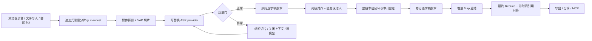
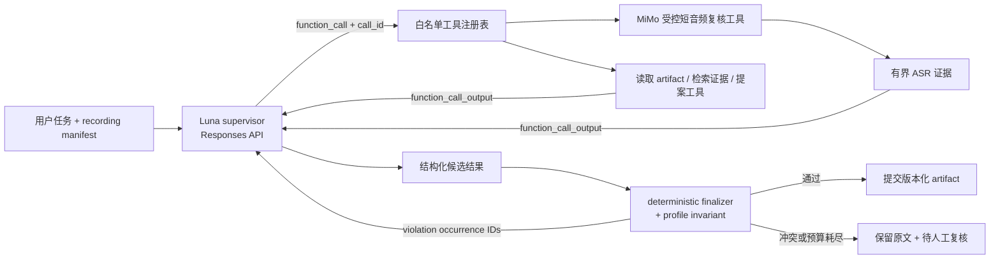

# 会议转录产品、开源语音栈与 Agent 架构调研

> 调研日期：2026-08-03。闭源产品没有公开完整内部实现。本文将表格中的“官方公开能力”视为来源事实；“架构启示”“适用位置”以及包含“应/建议/适合”的内容均为本文推断，不代表厂商披露的内部实现。

## 结论

言澜不应复制某一个竞品，而应组合四条路线：

1. 借鉴飞书妙记、Teams、Google Meet 和 Zoom 的“录音、逐字稿、时间定位、纪要、问答、协作”产品闭环。
2. 自研一个最小、可审计的 Responses Harness；借鉴 [openai-agents-js](https://github.com/openai/openai-agents-js) 的 runner、run state、guardrails 和 trace contract，但不直接引入它的完整多 Agent 抽象。
3. 借鉴 [LiveKit Agents](https://github.com/livekit/agents) 的 `AgentSession`、可替换语音插件和事件序列测试，借鉴 Vexa 的会议生命周期、workload 隔离和“先提案、后提交”边界；Pipecat 只作为音频 frame/pipeline 的参考。
4. Meetily、WhisperLive、FunASR、faster-whisper、WhisperX 和 pyannote 只位于可替换的采集、ASR、对齐或说话人层，不承担 Agent 决策和事实提交。

已选运行时不是 LangGraph 固定 workflow。**Agent Mode 只走 OpenAI Responses API**：一个 Luna supervisor 在有界循环中调用白名单工具，MiMo 作为受控转写工具提供初始 ASR 和疑难短音频复核，最终由确定性 finalizer 与 profile invariant 决定能否提交修订稿。Responses 的 function call 与 tool output 通过 `call_id` 关联；reasoning、function call 和 tool output items 在连续工具轮次中必须完整保留。[Function calling](https://developers.openai.com/api/docs/guides/function-calling#function-tool-example)、[Reasoning items](https://developers.openai.com/api/docs/guides/reasoning#keeping-reasoning-items-in-context)

核心差异化应是：录音优先增量持久化并显式显示未落盘状态、逐字稿可从录音重建、术语修正可审计、回答能回到具体时间。Agent 可以选择工具、路由异常和提出建议，不能自由重写事实或绕过提交门。

## 闭源产品公开方案

| 产品 | 官方公开的处理与产品能力 | 对架构的可靠启示 |
| --- | --- | --- |
| 飞书妙记 | 支持录音、上传、实时转写、中英文混说、发言人区分、时间轴、实时总结、要点/待办/风险、片段分享、评论和多格式导出。[飞书官方说明](https://www.feishu.cn/content/article/7578773484596153570) | 录音、逐字稿、洞察和协作不是四个页面，而是共享同一条带时间证据的数据链。声纹和实名说话人属于平台能力，不能从一个混合音轨轻易复刻。 |
| Microsoft Teams Intelligent Recap | notes/tasks 来自 transcript；章节还会使用 recording 和 PowerPoint Live；参会、提及和说话人时间线来自不同会议资产；内容继承组织的留存与权限策略。[Microsoft Learn](https://learn.microsoft.com/en-us/microsoftteams/privacy/intelligent-recap) | 事实资产要分层保存，不能把“总结 JSON”当唯一状态。会议权限、保留期限和派生内容应绑定同一 meeting identity。 |
| Google Meet | “Take notes for me”可在会中展示 summary so far，会后生成 Google Doc；支持可配置的总结、决策和下一步，官方建议用于约 15 分钟到 8 小时的会议，并明确录制/记笔记同意状态。[Google Meet Help](https://support.google.com/meet/answer/14754931?hl=en) | 长会议应增量归纳并在结束时合并，不应等整篇逐字稿完成后才启动单次总结。会中状态与最终纪要应是两个版本。 |
| Zoom AI Companion | Meeting Summary 以 speech-to-text 为基础；保留 transcript 后可继续做会后问答和文档，VTT 可下载；Voice Recorder 允许编辑/恢复 speaker name。[Meeting Summary](https://support.zoom.com/hc/en/article?id=zm_kb&sysparm_article=KB0058013)、[Transcript retention](https://support.zoom.com/hc/en/article?id=zm_kb&sysparm_article=KB0076631)、[Voice Recorder](https://support.zoom.com/hc/en/article?id=zm_kb&sysparm_article=KB0080794) | 逐字稿是后续 AI 能力的事实索引；说话人身份必须允许人工纠正和回退。 |
| Otter | 官方建议使用 custom vocabulary、custom names，并通过人工标记 speaker 改善之后的识别。[准确率指南](https://help.otter.ai/hc/en-us/articles/18934488820887-Tips-on-improving-speech-transcript-accuracy)、[Speaker identification](https://help.otter.ai/hc/en-us/articles/37817241040535-Best-Practices-to-Maximize-Speaker-Identification) | 专有名词和说话人不是纯后处理问题。用户词表应尽早进入 ASR，人工确认结果应沉淀为以后可复用的上下文。 |

推断：成熟产品普遍把会议看成一组有共同权限和生命周期的资产，而不是“一段音频调用两个模型”。言澜当前纯前端形态可以保留隐私优势，但数据结构也应逐步升级为版本化资产。

## 开源产品与基础组件

| 方案 | 可以从官方代码或文档确认的能力 | 限制与适用位置 |
| --- | --- | --- |
| [OpenAI Agents SDK for JavaScript](https://github.com/openai/openai-agents-js) | 提供 `Runner`/`run` 循环、可恢复的 `RunState`、tools、sessions、input/output/tool guardrails、handoff 和内置 tracing；官方运行指南还暴露 `maxTurns` 等循环边界。[Running agents](https://openai.github.io/openai-agents-js/guides/running-agents/)、[Guardrails](https://openai.github.io/openai-agents-js/guides/guardrails/)、[Tracing](https://openai.github.io/openai-agents-js/guides/tracing/) | 作为 harness contract 和测试参照，不作为言澜首版运行时依赖。言澜需要的是单 supervisor、录音 artifact 和确定性提交门，不需要通用 handoff、多 Agent 或 provider-agnostic 兼容层。 |
| [LiveKit Agents](https://github.com/livekit/agents) | `AgentSession` 管理用户交互，STT/LLM/TTS/Realtime provider 以插件组合；内置 function tools、MCP、任务调度和测试框架，可逐事件断言 function call、tool output 与 assistant message。[官方 README](https://github.com/livekit/agents#readme)、[测试示例](https://github.com/livekit/agents#testing) | 借 `AgentSession` 的生命周期边界、语音插件接口和事件序列测试；当前会议记录产品不复制它的 WebRTC、电话、实时双向 TTS 和完整 server runtime。 |
| [Vexa](https://github.com/Vexa-ai/vexa) | Bot 加入 Meet/Teams/Zoom/Jitsi，实时转录；gateway、meeting-api、agent-api、runtime、Redis、Postgres、MinIO 分层，Bot 与 Agent 使用隔离 workload；Agent API 以 SSE 暴露 `tool-call`、`tool-result`、`commit` 等事件。其 README 明确将不可信输入置于 propose-only 路径，由人或可信代码提交。[Agent API](https://github.com/Vexa-ai/vexa/blob/main/docs/docs/api/agent.mdx)、[Runtime](https://github.com/Vexa-ai/vexa/blob/main/docs/docs/core/runtime.mdx) | 借会议 `idle/scheduled -> requested/joining/awaiting_admission/active/stopping -> completed/failed` 状态机、执行隔离和“提案不等于提交”。不复制容器/Kubernetes coding-agent workspace；当前 README 也标注部分实时 Copilot/WebSocket 能力尚未在 open-core 路径接通。[Meetings lifecycle](https://github.com/Vexa-ai/vexa/blob/main/docs/docs/core/meetings.mdx) |
| [Pipecat](https://github.com/pipecat-ai/pipecat) | 提供面向实时语音/多模态应用的 frame、processor、pipeline、transport 和多 provider 组件，并提供 observer/telemetry 扩展点。[README](https://github.com/pipecat-ai/pipecat#readme) | 只借音频 frame 传递、背压、取消和 processor 可组合性；不采用 Pipecat Flows 或其 Agent orchestration 作为言澜控制面。 |
| [Meetily](https://github.com/Zackriya-Solutions/meetily) | 本地桌面录音，Whisper/Parakeet 可在本机处理；外部 provider 失败时录音仍保存在本机并可重转录。[Provider 文档](https://docs.meetily.ai/features/transcription-providers)、[重转录](https://docs.meetily.ai/features/retranscription)、[Releases](https://github.com/Zackriya-Solutions/meetily/releases) | 云 provider 会接收音频；重转录覆盖旧稿且不自动更新总结；speaker diarization 仍为 beta。崩溃恢复目前只有 release-note 级说明，不能据此推断分片或原子提交机制。 |
| [WhisperLive](https://github.com/collabora/WhisperLive) | 提供基于 Whisper/faster-whisper/TensorRT 的实时转写服务和多客户端接入，可作为自托管流式 ASR 服务参考。[README](https://github.com/collabora/WhisperLive#readme) | 是实时 ASR 服务，不提供 recording-wide entity state、Agent tool loop、guardrails 或提交不变量；只放在 provider adapter 后面。 |
| [FunASR](https://github.com/modelscope/FunASR) | ASR、VAD、标点、时间戳、热词、speaker verification/diarization、流式服务和 OpenAI 兼容接口可组合，但能力取决于具体模型和 checkpoint。[API](https://modelscope.github.io/FunASR/api.html) | 并非所有 checkpoint 都支持时间戳、热词和说话人能力；工具代码与模型权重许可也可能不同，部署前必须逐个检查模型卡。 |
| [faster-whisper](https://github.com/SYSTRAN/faster-whisper) | 批处理、Silero VAD、词级时间戳；segment 暴露 `avg_logprob`、`compression_ratio`、`no_speech_prob`，并支持 hotwords、重复抑制、上下文开关和 hallucination silence threshold。[transcribe.py](https://github.com/SYSTRAN/faster-whisper/blob/master/faster_whisper/transcribe.py) | 是 ASR 引擎，不负责会议状态、可靠实名说话人或协作。它证明质量门应使用模型信号，而不只是 HTTP 成功。 |
| [WhisperX](https://github.com/m-bain/whisperX) | VAD 预切分、faster-whisper 批处理、wav2vec2 强制对齐和 pyannote diarization，可生成更细的词级时间。[README](https://github.com/m-bain/whisperX) | 适合会后精修，不应阻塞实时逐字稿。官方也明确重叠语音、数字/符号对齐和 diarization 并不完美。 |
| [pyannote.audio](https://github.com/pyannote/pyannote-audio) | 可在本地运行 speaker diarization，输出匿名说话人时间段，并可使用已知说话人数约束。[README](https://github.com/pyannote/pyannote-audio) | 聚类结果是 `SPEAKER_00`，不是人的姓名。姓名需要会议平台参与者事件、独立音轨、用户命名或经过同意的声纹注册。 |
| [Attendee](https://github.com/attendee-labs/attendee) | 官方 README 描述 Zoom SDK 与 Google Meet 全 Chrome Bot 的实现差异，并提供统一 REST 抽象；但同一 README roadmap 仍将 Google Meet support 标为未完成，默认 Zoom 转录还依赖外部凭据和 Deepgram，因此仅作架构参考，不作成熟度证据。 | 自动入会本身就是独立基础设施产品，不应塞进当前静态前端。 |

会议平台能直接提供参与者事件或每人独立音轨时，说话人身份通常比混合音轨聚类可靠。Recall 官方说明独立音轨通常更准确：一人一设备是推荐的“perfect”路径，共享设备更适合 hybrid diarization；同一音轨里多人仍只能得到匿名标签。active-speaker 事件并不完整，实时独立音轨也会增加转录用量。[Recall diarization](https://docs.recall.ai/docs/diarization)

## 推荐语音管线

每个阶段都应输出结构化 artifact，至少包含：

- `meetingId`、`chunkId`、绝对时间范围和输入哈希；
- provider、模型版本、语言、参数和运行时间；
- 原始响应派生的质量指标，不保存 secret；
- 输入 artifact 版本、输出 artifact 版本和失败状态；
- 术语补丁的 `from`、`to`、时间、接受状态和原因。

这样才能安全地重跑一个失败片段，而不是覆盖整场会议。

## Agent 方案

### 已选架构：自研 Responses Harness

Agent 应是受约束的控制面，不是逐字稿的事实作者。言澜不直接依赖 openai-agents-js，也不把现有 ASR、校正、总结函数简单包装成“Agent”；首版只实现产品所需的最小 Responses loop：

运行时责任必须分开：

| 单元 | 负责 | 明确不负责 |
| --- | --- | --- |
| Luna supervisor | 理解目标、选择白名单工具、根据 tool output 决定下一步、提出术语补丁和派生内容 | 不直接读取 API key，不修改 raw ASR，不决定时间戳/说话人，不提交最终 artifact |
| MiMo 受控工具 | 当前只读取本会议中由 runtime 截取的不超过 30 秒音频，执行复核 ASR 并返回有界证据 | 不接收任意 URL/路径，不调用其他工具，不做总结、术语统一或最终写入 |
| deterministic finalizer | 重放补丁，验证 schema、来源哈希、时间/说话人几何、术语一致性、引用证据和输出完整性 | 不补写模型遗漏，不猜 canonical，不把失败候选自动降级为成功 |
| profile invariant | 当前验证逐字稿覆盖、候选证据、映射冲突、来源哈希与时间/说话人几何；后续再抽象成可组合 registry | 不依赖 prompt 自觉；不把 `Descheduler` 或其他 fixture 术语硬编码进通用流程 |

Harness 的最小 contract 如下：

1. **Runner**：解析 Responses typed items；只要仍有 function call 就继续，只有 response 已完成、没有待处理 call 且存在非空 assistant output 才能进入 finalizer。循环必须有 model turn、tool call、时间和取消预算。
2. **State**：以 `recordingId/runId` 保存完整 output items、`call_id`、tool outputs、artifact versions、预算和 violations。手工管理上下文时，reasoning、function call 与 tool output items 自最近 user message 起原样回传，不能只拼接文本。[Responses items](https://developers.openai.com/api/docs/guides/migrate-to-responses#2-map-messages-to-items)、[Reasoning context](https://developers.openai.com/api/docs/guides/reasoning#keeping-reasoning-items-in-context)
3. **Tool registry**：所有 function tools 使用严格 JSON Schema；object 禁止额外字段，参数由 harness 本地再次校验，tool output 必须复制模型给出的准确 `call_id`。副作用工具要求幂等键和显式授权。[Strict mode](https://developers.openai.com/api/docs/guides/function-calling#strict-mode)
4. **Guardrails**：input guardrail 限制任务范围与录音大小；tool guardrail 检查权限、参数、路径和预算；output guardrail 只验证候选结构。真正的事实提交仍由 finalizer/invariant 完成。openai-agents-js 的 guardrail 分层是接口参考，不是运行时依赖。[Guardrails](https://openai.github.io/openai-agents-js/guides/guardrails/)
5. **Trace**：一场录音使用一个 trace，至少记录 model turn、tool call/output、guardrail、`term.discover`、`term.resolve`、`invariant.validate`、`repair.segment` 和 commit；敏感音频、key 与完整 prompt 默认不进入 trace payload。[OpenAI tracing](https://developers.openai.com/api/docs/guides/agents/integrations-observability#tracing)
6. **Finalization**：模型只能返回 proposal。任何 pending call、incomplete response、空 final、预算超限、canonical 冲突或不变量失败都不能提交；只修复 violation 指向的片段，达到重试上限后保留原文并转人工复核。

Agent Mode 的模型请求只使用 Responses API，不回退到 Chat Completions，也不混用第二套会话状态。Responses 提供底层 typed-item/function-call 原语，自研 harness 持有产品级 artifact 和不变量；这与 Agents SDK 提供通用 runner/lifecycle 的定位不同。[Responses API 与 Agents SDK 对比](https://developers.openai.com/api/docs/guides/agents#compare-the-responses-api-and-agents-sdk)

### 为什么不选 LangGraph 固定 workflow

LangGraph 的 persistence、task 和 interrupt 文档仍是 checkpoint、幂等恢复与人工批准的可靠对照资料，但不作为言澜 Agent Mode 的主运行时。[Persistence](https://docs.langchain.com/oss/python/langgraph/persistence)、[Functional API](https://docs.langchain.com/oss/python/langgraph/functional-api)、[Interrupts](https://docs.langchain.com/oss/python/langgraph/interrupts)

原因不是放弃确定性，而是把确定性放在正确层：Luna 根据当前 run state 在白名单工具中选择下一步，harness 用预算和 guardrails 限制循环，finalizer/invariant 决定能否提交。录音 checkpoint 是 versioned run state 和 artifact manifest，不是预先写死的 `ASR -> 校正 -> 总结` 节点图。固定、无需模型判断的步骤继续使用普通函数，不伪装成 Agent。

### 权限边界

推荐职责如下：

| 能力 | Agent 权限 | 约束 |
| --- | --- | --- |
| 异常路由 | 可在固定策略内选择缩短切片、关闭历史上下文或切换已配置 provider | 不得将未通过质量门的文本晋升为可信逐字稿；保留隔离的原始输出、失败原因和重试历史供人工检查 |
| 术语校正 | 可提出最小 patch | 显式 `alias -> canonical` 在整段录音中确定性应用；其他候选按 alias 独立准入，并要求整段重复、canonical 唯一，以及词形相似性、用户规范词或多个相似写法形成的录音级锚点；同一 alias 的 canonical 冲突时保留原文 |
| 总结与问答 | 可读取修订逐字稿并并行 Map/Reduce | 金句、决策和面试证据必须回指现有时间片与原话 |
| 分享与外部写入 | 默认无权限 | 生成公开链接、加入会议、发消息或写任务前必须展示目标和内容并确认 |

MCP 适合放在最外层，把言澜能力提供给 Codex、Claude、Cursor 等 Agent；它不是内部任务调度器，也不替代 Responses Harness。MCP 官方架构只定义上下文与工具交换，不规定应用如何编排模型；当前 Tools 规范建议始终保留人工拒绝工具调用的能力，并要求把非可信服务器的 tool annotations 当作不可信输入。[Architecture](https://modelcontextprotocol.io/docs/learn/architecture)、[Tools](https://modelcontextprotocol.io/specification/draft/server/tools)

当前术语 profile 的内部白名单工具保持最小：

- `read_transcript_window`：顺序读取不可变逐字稿窗口，并记录录音覆盖率；
- `submit_term_candidates`：提交 alias、canonical、置信度和 segment evidence，不修改逐字稿；
- `reject_term_candidates`：显式撤回被后续证据否定的模型候选；用户明确映射不可撤回；
- `scan_alias_occurrences` / `validate_mapping_group`：整段扫描并验证候选组；
- `transcribe_audio_range`：可选调用 MiMo 复核本会议不超过 30 秒的疑难范围；
- `finalize_correction`：唯一提交入口，由确定性代码应用补丁和生成可回放 ledger。

`inspect_job`、`retry_chunk`、`ask_with_timestamps`、`export_meeting` 和会议 Bot 管理可以随后包装为 MCP 工具。底层 artifact commit 不暴露给 supervisor 或外部 MCP；它是 `finalize_correction` 通过 invariant 后调用的可信代码路径。`export_meeting` 只写入用户明确指定的本地路径。

Vexa 官方 MCP 文档展示了如何把“加入会议、读取 transcript、管理 recording”暴露为 Agent tools；是否能用于生产仍需结合当前 README、release 状态和实测判断。这些工具也不会自动获得正确性、幂等性或授权边界。[Vexa MCP](https://docs.vexa.ai/vexa-mcp)

## 言澜落地顺序

### 当前纯前端版

- 配置和 BYOK 设置保存在 localStorage；大体积录音分片保存在 IndexedDB，不把 Blob 写入 localStorage。
- MiMo chat 路径对未知时长且超过阈值的文件在 Web Audio 完整解码前失败；标准 `/audio/transcriptions` 路径不依赖这项限制。
- MiMo 分片结果经过每秒字符数、每秒 completion token 数和重复 n-gram 质量门，异常片段缩短后重试。
- 事实层只对重复的无语义口头填充词做可回放去重；普通文本重叠和英文词干都保留原文，避免删除条件、模态或事实语境。
- GPT 只返回术语 patch；明确 alias 由程序全录音扫描并确定性应用，重复候选在所有批次聚合后统一回放，canonical 冲突或证据不足时保留原文。
- 长总结使用有上限并发和稳定顺序，后续把每层结果写入版本化 artifact，而不是只保存在一次模型响应中。

### Agent Mode v1

- 固定一个 Luna supervisor，通过 Responses API 运行；模型、reasoning effort、tools 和预算由配置钉住，supervisor 无权动态更换模型或扩大权限。
- 已实现轻量 Responses runner，不引入 openai-agents-js 或 LangGraph 运行时依赖；运行中原样保留完整 typed items、准确 `call_id`、reasoning items 和 tool outputs，持久化不含正文的 run trace 与轮次/工具用量。
- 首个 profile 开放 `read_transcript_window`、`submit_term_candidates`、`reject_term_candidates`、`scan_alias_occurrences`、`validate_mapping_group`、可选 `transcribe_audio_range` 和 `finalize_correction`；所有参数使用 strict schema 并在执行前本地复验。
- MiMo 只在 runtime 控制的初始转写与 `transcribe_audio_range` 内运行；工具不获得存储凭据、任意文件读取或提交权限。
- finalizer 在提交前运行 transcript coverage、mapping evidence/conflict、source hash、timeline 与 speaker invariant；失败返回结构化 violations，模型可在预算内继续调用工具。
- 用 fake Responses client 建立 runtime contract tests：非法 schema/arguments 不执行工具，tool output 保留准确 `call_id`，reasoning items 原样回传，并行调用不串线，预算耗尽前停止副作用，有 pending call 或 incomplete/empty response 时不得 final。
- 一场录音对应一个本地 trace/run record；当前只记录 item 类型、id、轮次、工具名、输出长度和验证结果，不记录 key、原始音频或完整逐字稿窗口。

### 可选本地 companion

- 中文面试优先验证 Paraformer/ContextualParaformer + FSMN-VAD + 标点；需要解码偏置时使用其模型级 hotword。SenseVoice 作为快速多语种/CPU 基线；`错误词 -> 目标词` 显式后处理作为独立、可审计的公共层。
- 国际化可选 faster-whisper；会后按需运行 WhisperX + pyannote。
- 用 OpenAI-compatible transcription API 让网页、CLI 和 Agent Skill 共用一个适配层。
- 原始 ASR、修订稿、speaker label、总结分别版本化，不覆盖历史。

### 团队托管版

- 只有用户需要自动入会时，才引入 Vexa/Attendee 式 Bot runtime。
- 使用 Postgres 保存任务状态、对象存储保存录音分片、队列执行 ASR/总结。
- 平台参与者事件和独立音轨优先于机器猜测姓名。
- Agent runtime 与录音/凭据隔离，采用 Vexa 式 deny-by-default egress 和 propose-only 输入边界，只能通过受审计、白名单化的模型与工具代理访问外部服务；不直接持有录音存储凭据，也不拥有 final commit 权限。

## 不应复制的做法

- 不宣称混合音轨的匿名聚类等于可靠实名说话人识别。
- 不让 GPT 为了改一个词重写完整逐字稿。
- 不把固定的 `ASR -> 校正 -> 总结` 函数链改名为 Agent，也不使用 LangGraph 固定 workflow 作为 Agent Mode 主运行时。
- 不让 Agent Mode 回退到 Chat Completions，或同时维护两套不一致的 tool loop 与会话状态。
- 不让 Luna 或 MiMo 绕过 deterministic finalizer 直接提交逐字稿、术语台账、总结或外部写入。
- 不把 `finish_reason=stop` 或 HTTP 200 当作转写正确的证据。
- 不在没有原话和时间引用时生成确定性的关键决策或面试结论。
- 不让 Agent 自动决定候选人录用、淘汰，或依据声音、口音和敏感属性推断能力。
- 不为追求“自动入会”过早引入重型服务端，从而破坏个人版的本地隐私与易用性。
